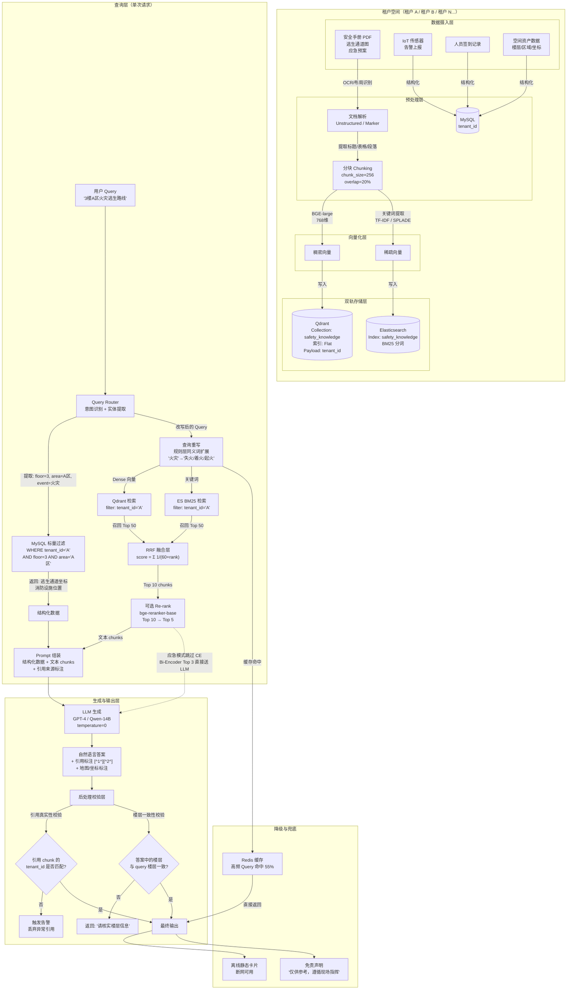
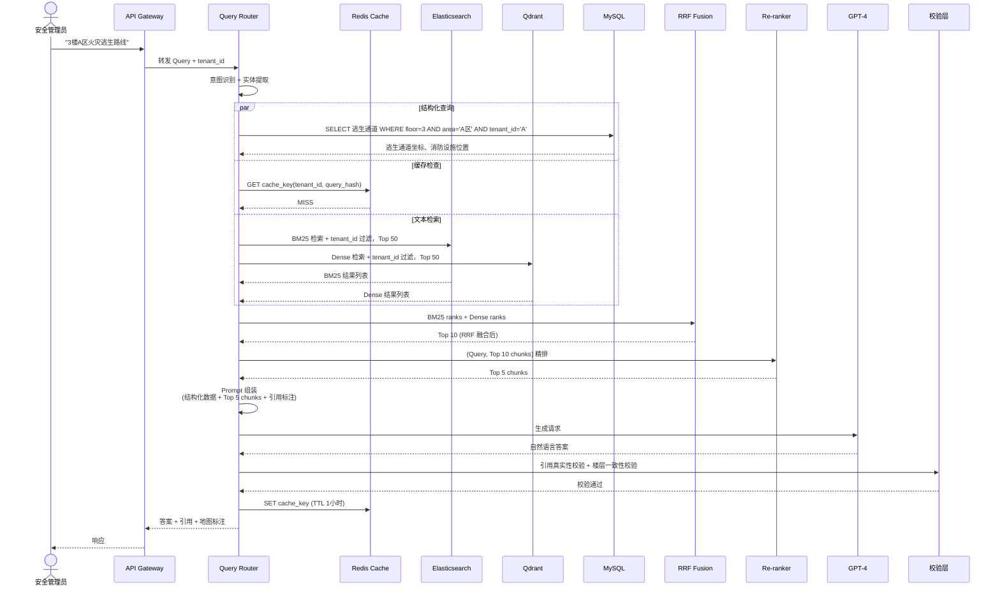

# SaaS 多租户应急安全 RAG 架构 — Qdrant + ES 双轨方案

## 完整流程图



---

## 流程说明

### 1. 数据摄入层
- **静态文档**（PDF/扫描件）：安全手册、逃生通道图、应急预案
- **实时数据**：IoT 告警、签到记录、巡检隐患
- **空间资产**：楼层、区域、坐标、消防设施位置

### 2. 预处理层
- 文档解析：Unstructured / Marker 提取结构
- 分块：256 tokens，overlap 20%，按章节条款切分
- 结构化数据直接入库 MySQL（带 tenant_id）

### 3. 双轨存储层（核心）

| 存储 | 数据 | 作用 | 索引 |
|------|------|------|------|
| **Qdrant** | Dense 向量（BGE-large 768维） | 语义匹配、口语化查询 | Flat（单租户 <5000 条） |
| **Elasticsearch** | Sparse 向量（BM25 关键词） | 精确匹配楼层/区域/设备号 | 倒排索引 |
| **MySQL** | 空间资产、IoT 数据、签到记录 | 结构化查询、标量过滤 | B+Tree |

### 4. 查询层

```
用户 Query
    ↓
Query Router（提取实体：楼层/区域/事件）
    ↓
├─→ MySQL 标量过滤（精确约束）
│       └─→ 逃生通道坐标、消防设施位置
│
└─→ 查询重写（同义词扩展）
        ├─→ Qdrant（Dense）召回 Top 50
        ├─→ ES（BM25）召回 Top 50
        └─→ RRF 融合 → Top 10
                ↓
        可选 CE 精排 → Top 5
                ↓
        Prompt 组装（结构化数据 + 文本 chunks）
```

### 5. 生成与校验层

| 校验层 | 作用 | 失败处理 |
|--------|------|---------|
| **引用真实性校验** | 确认 chunk 的 tenant_id 与当前租户一致 | 丢弃异常引用，触发告警 |
| **楼层一致性校验** | 答案中的楼层与 query 楼层一致 | 返回"请核实楼层信息" |
| **安全关键词校验** | 应急 query 是否包含关键防护词 | 触发二次检索或降级 |

### 6. 降级策略

```
正常流程: Query → 重写 → Hybrid Search → CE 精排 → LLM → 输出
                    ↓
应急降级: Query → 重写 → Hybrid Search → 跳过 CE → LLM → 输出
                    （延迟 500ms → 150ms，精度掉 2%）
                    ↓
缓存短路: Query → Redis 命中 → 直接返回
                    （延迟 50ms）
                    ↓
离线兜底: 网络断开 → 本地静态卡片 → 直接返回
```

---

## 关键设计决策

```
┌─────────────────────────────────────────────────────────────┐
│  决策 1：为什么 Qdrant + ES 分开，而不是单一数据库？           │
│  ───────────────────────────────────────────────            │
│  • ES 的 BM25 经过十几年验证，精确匹配无可替代                 │
│  • Qdrant 的 Dense 检索轻量、快速、多租户友好                  │
│  • RRF 融合在应用层做，可控性强，不依赖单一数据库的成熟度       │
└─────────────────────────────────────────────────────────────┘

┌─────────────────────────────────────────────────────────────┐
│  决策 2：为什么 Qdrant 用 Flat 不用 HNSW？                   │
│  ─────────────────────────────────────                      │
│  • 单租户 200~2000 条，Flat 检索 < 1ms，够快                 │
│  • Flat 召回率 100%，应急场景不丢关键信息                     │
│  • 零建索引时间，新租户 onboarding 秒级完成                   │
│  • 单租户 >5000 条时自动切 HNSW（目前仅 3 个大客户）          │
└─────────────────────────────────────────────────────────────┘

┌─────────────────────────────────────────────────────────────┐
│  决策 3：多租户隔离怎么做？                                   │
│  ─────────────────────                                      │
│  • Qdrant：共享 Collection + Payload tenant_id 过滤          │
│  • ES：共享 Index + tenant_id 字段过滤                       │
│  • MySQL：独立表 + tenant_id 字段                            │
│  • 应用层：二次校验，确保检索结果的 tenant_id 与 query 一致    │
│  • 缓存：Redis key 带 tenant_id 前缀，物理隔离                │
└─────────────────────────────────────────────────────────────┘
```

---

## 数据流时序图（一次完整请求）



---

## 一句话总结

> **Qdrant 管语义（Dense），ES 管精确（BM25），MySQL 管结构化（坐标/楼层），应用层做融合（RRF）和校验（租户隔离）。Flat 索引支撑中小租户的低延迟，HNSW 作为大客户超规模的备选。三层校验（引用真实 + 楼层一致 + 安全关键词）确保应急场景下的安全底线。**
