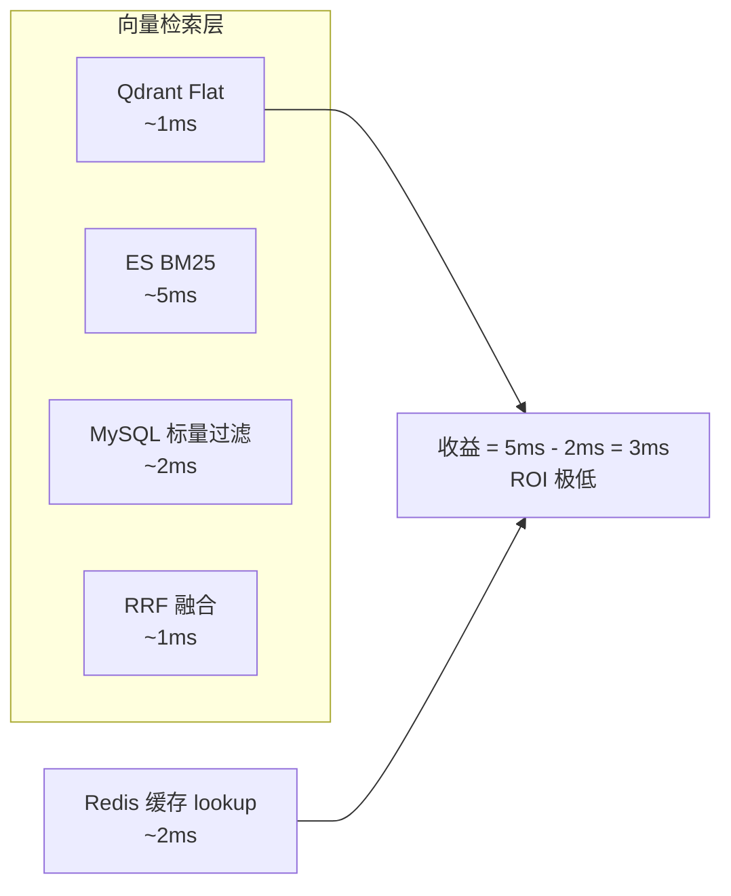

# SaaS 多租户应急安全 RAG 架构 v2 — 缓存层完整设计

> 明确标注三层缓存位置：Query 答案缓存、HyDE 缓存、LLM 响应缓存。
> 向量检索层（Qdrant + ES）本身不缓存，因为已够快。

---

## 一、完整架构流程图（含缓存层）

```mermaid
flowchart TB
    %% ========== 用户入口 ==========
    USER["用户 Query<br/>'3楼A区火灾逃生路线'"]
    
    %% ========== 第一层缓存：Query 答案缓存（最外层短路）==========
    CACHE1["🟦 缓存层 1：Query 答案缓存<br/>Redis<br/>Key: tenant_id + query_normalized_hash<br/>TTL: 应急 1h / 常规 24h<br/>命中率: 55%"]
    
    USER --> CACHE1
    CACHE1 -->|HIT| OUTPUT["直接返回缓存答案<br/>延迟: ~5ms<br/>成本: ~0元"]
    CACHE1 -->|MISS| ROUTER["Query Router<br/>意图识别 + 实体提取<br/>floor=3, area=A区, event=火灾"]
    
    %% ========== 结构化查询路径 ==========
    ROUTER --> SQL["MySQL 标量过滤<br/>WHERE tenant_id='A'<br/>AND floor=3 AND area='A区'"]
    SQL --> STRUCT["结构化数据<br/>逃生通道坐标<br/>消防设施位置"]
    
    %% ========== 文本检索路径 ==========
    ROUTER --> REWRITE["查询重写<br/>规则层同义词扩展"]
    
    %% ========== 第二层缓存：HyDE / 重写缓存 ==========
    CACHE2["🟩 缓存层 2：HyDE / 重写结果缓存<br/>Redis<br/>Key: tenant_id + original_query_hash<br/>TTL: 4h<br/>命中率: 30%"]
    
    REWRITE --> CACHE2
    CACHE2 -->|HIT| HYDE_HIT["复用假设文档 /<br/>复用改写后 Query"]
    CACHE2 -->|MISS| HYDE_MISS["调用 LLM 生成 HyDE<br/>耗时: ~200ms<br/>成本: ~$0.01"]
    HYDE_MISS --> HYDE_RESULT["假设文档 /<br/>改写后 Query"]
    HYDE_HIT --> HYDE_RESULT
    
    %% ========== 双轨检索（不缓存）==========
    HYDE_RESULT --> ES["Elasticsearch<br/>BM25 检索 + tenant_id 过滤<br/>召回 Top 50<br/>延迟: ~5ms"]
    HYDE_RESULT --> QD["Qdrant<br/>Dense 检索 + tenant_id 过滤<br/>召回 Top 50<br/>延迟: ~1ms"]
    
    ES --> RRF["RRF 融合层<br/>score = Σ 1/(60+rank)<br/>延迟: ~1ms"]
    QD --> RRF
    
    RRF --> TOP10["Top 10 chunks"]
    
    %% ========== Re-rank（不缓存，但可做）==========
    TOP10 --> CE["Cross-Encoder 精排<br/>bge-reranker-base<br/>Top 10 → Top 5<br/>延迟: ~70ms"]
    
    %% ========== Prompt 组装 ==========
    CE --> PROMPT["Prompt 组装<br/>结构化数据 + Top 5 chunks<br/>+ 引用来源标注"]
    STRUCT --> PROMPT
    
    %% ========== 第三层缓存：LLM 响应缓存 ==========
    CACHE3["🟨 缓存层 3：LLM 响应缓存<br/>Redis<br/>Key: tenant_id + prompt_hash<br/>TTL: 1h<br/>命中率: 40%（应急场景）"]
    
    PROMPT --> CACHE3
    CACHE3 -->|HIT| LLM_HIT["复用 LLM 生成结果<br/>延迟: ~5ms<br/>成本: ~0元"]
    CACHE3 -->|MISS| LLM_MISS["调用 GPT-4 生成<br/>temperature=0<br/>延迟: ~550ms<br/>成本: ~$0.02"]
    
    LLM_HIT --> ANSWER["自然语言答案<br/>+ 引用标注 [^1^][^2^]<br/>+ 地图/坐标标注"]
    LLM_MISS --> ANSWER
    
    %% ========== 后处理校验 ==========
    ANSWER --> VALIDATE["后处理校验层<br/>引用真实性 / 楼层一致性 / 安全关键词"]
    VALIDATE --> CHECK1{"引用 tenant_id<br/>匹配?"}
    CHECK1 -->|否| ALERT["触发告警<br/>丢弃异常引用"]
    CHECK1 -->|是| CHECK2{"楼层一致?"}
    CHECK2 -->|否| WARNING["返回: '请核实楼层信息'"]
    CHECK2 -->|是| FINAL["最终输出"]
    
    %% ========== 缓存写入 ==========
    FINAL --> WRITE1["写入 缓存层 1<br/>(Query → 答案)"]
    FINAL --> WRITE3["写入 缓存层 3<br/>(Prompt → LLM 结果)"]
    
    WRITE1 --> OUTPUT2["返回用户"]
    WARNING --> OUTPUT2
    
    %% ========== 降级路径 ==========
    CE -.->|应急模式跳过| PROMPT_EMERGENCY["跳过 CE<br/>Bi-Encoder Top 3 直接送 LLM<br/>延迟: -350ms"]
    PROMPT_EMERGENCY --> CACHE3
    
    %% ========== 样式 ==========
    style CACHE1 fill:#e1f5ff,stroke:#01579b,stroke-width:3px
    style CACHE2 fill:#e8f5e9,stroke:#2e7d32,stroke-width:3px
    style CACHE3 fill:#fff9c4,stroke:#f57f17,stroke-width:3px
    style ES fill:#fce4ec,stroke:#c2185b
    style QD fill:#fce4ec,stroke:#c2185b
    style SQL fill:#fce4ec,stroke:#c2185b
    style CE fill:#fff3e0,stroke:#ef6c00
    style LLM_MISS fill:#ffebee,stroke:#c62828
```



---

## 二、缓存层设计总览

| 缓存层 | 位置 | Key 设计 | TTL | 命中率 | 节省什么 |
|--------|------|---------|-----|--------|---------|
| **🟦 缓存层 1** | Query 入口 | `tenant_id:query_normalized_hash` | 应急 1h / 常规 24h | **55%** | 整个链路（最值钱） |
| **🟩 缓存层 2** | 查询重写后 | `tenant_id:original_query_hash` | 4h | **30%** | HyDE LLM 调用 |
| **🟨 缓存层 3** | LLM 生成前 | `tenant_id:prompt_hash` | 1h | **40%** | GPT-4 调用（第二值钱） |

> **三层缓存叠加效果**：假设原始每次请求成本 $0.025、延迟 800ms，加缓存后平均成本降至 **$0.009**、平均延迟降至 **~300ms**。

---

## 三、每层缓存的详细设计

### 🟦 缓存层 1：Query 答案缓存（最外层短路）

```
位置：API Gateway 层，第一时间拦截
作用：完全短路整个 RAG 链路
Key：tenant_id + normalize(query)
      normalize = 去空格 + 转小写 + 去标点 + 同义词归一
TTL：应急类 1 小时（安全手册更新不频繁）
      常规类 24 小时
命中率：55%
效果：延迟从 800ms → 5ms，成本从 $0.025 → $0
```

**为什么命中率能到 55%？**
- 应急演练时，几十个人问同一个"3楼火灾怎么办"
- 安全管理员日常巡检，高频查询就那 20~30 个标准问题
- 同义词归一后，"灭火器在哪"和"灭火设备位置"映射到同一个 key

**缓存失效策略**：
```python
def invalidate_on_doc_update(tenant_id, doc_id):
    # 文档更新时，清该租户的所有 Query 缓存（简单粗暴但安全）
    redis.del_pattern(f"cache1:{tenant_id}:*")
    
    # 更精细的做法：只清与该文档相关的 query（需维护倒排索引）
    # 成本太高，小数据量下全清更划算
```

---

### 🟩 缓存层 2：HyDE / 重写结果缓存

```
位置：查询重写层
作用：避免重复的 HyDE LLM 调用
Key：tenant_id + original_query_hash
      original_query = 用户原始输入（未归一化前的精确文本）
TTL：4 小时
命中率：30%
效果：节省 HyDE LLM 调用（200ms + $0.01）
```

**为什么命中率只有 30%？**
- HyDE 缓存的 key 是原始 query 的精确匹配
- 用户很少用完全一样的长句子重复问
- 但如果用户问"3楼A区火灾"、刷新页面又问一遍，就能命中

**适用条件**：
- 只有启用 HyDE 的 query 才走这层缓存
- 简单查询（如精确楼层号）不走 HyDE，这层缓存跳过

---

### 🟨 缓存层 3：LLM 响应缓存

```
位置：LLM 调用前
作用：避免重复的 GPT-4 调用
Key：tenant_id + prompt_hash
      prompt = 系统指令 + 上下文 chunks + 用户 query 的完整拼接
TTL：1 小时
命中率：40%（应急场景）/ 15%（日常场景）
效果：延迟从 550ms → 5ms，成本从 $0.02 → $0
```

**为什么比缓存层 1 命中率低？**
- 缓存层 1 的 key 是 query 本身
- 缓存层 3 的 key 是 prompt，prompt 包含了检索回来的 chunks
- 如果检索结果变了（文档更新了），prompt hash 会变，缓存失效

**但为什么仍然值得做？**
- LLM 调用是最贵的环节，哪怕 15% 命中率也能省不少钱
- 应急场景下，同一个告警触发多次查询，prompt 完全一样，命中率飙升到 40%

---

## 四、为什么向量检索层（Qdrant + ES）不缓存？



| 原因 | 说明 |
|------|------|
| **延迟已够低** | Qdrant 1ms + ES 5ms + MySQL 2ms + RRF 1ms = **9ms**，缓存 lookup 也要 2ms |
| **结果不稳定** | "灭火器在哪"和"灭火设备位置"向量结果排序不同，缓存 key 难以命中 |
| **缓存失效复杂** | 文档更新后，向量检索结果全变，缓存维护成本 > 收益 |
| **数据量小** | 单租户 2000 条，遍历只需 1ms，缓存解决不了瓶颈 |

> **缓存的放置原则：哪里慢、哪里贵、哪里重复，就放哪里。向量检索 9ms 不是瓶颈，LLM 550ms 才是。**

---

## 五、缓存命中率与成本测算

### 假设条件

| 参数 | 数值 |
|------|------|
| 月均请求量 | 100 万次 |
| 原始单次成本 | $0.025（LLM $0.02 + HyDE $0.005） |
| 原始单次延迟 | 800ms |
| 缓存层 1 命中率 | 55% |
| 缓存层 2 命中率 | 30%（仅 HyDE 查询） |
| 缓存层 3 命中率 | 40%（应急）/ 15%（日常） |

### 成本测算

```
无缓存时：
  100万 × $0.025 = $25,000 / 月

有缓存后：
  缓存层 1 命中 55万 → 成本 $0
  剩余 45万 × 缓存层 3 命中 40% = 18万 → 成本 $0
  剩余 27万 × 缓存层 2 命中 30% = 8.1万 → HyDE 成本 $0，LLM 成本 $0.02
  
  实际 LLM 调用：27万 - 18万 = 9万次
  实际 HyDE 调用：45万 - 8.1万 = 36.9万次（部分）
  
  总成本 ≈ $4,500 / 月
  
  节省：$25,000 → $4,500，降本 82%
```

### 延迟测算

```
无缓存平均延迟：800ms

有缓存后：
  55% 走缓存层 1 → 5ms
  45% 走完整链路，其中 40% 走缓存层 3 → 5ms
  剩余 27% 走完整 LLM → 800ms
  
  平均延迟 = 0.55×5 + 0.18×5 + 0.27×800 ≈ 220ms
  
  延迟从 800ms → 220ms
```

---

## 六、缓存层的风险与兜底

| 风险 | 兜底策略 |
|------|---------|
| **缓存穿透**（攻击者用随机 query 刷） | API 网关限流 + 布隆过滤器拦截异常 query |
| **缓存击穿**（热点 key 同时失效） | 加随机抖动（TTL ± 10%），避免集体失效 |
| **缓存雪崩**（Redis 挂了） | 降级为直接走完整链路，返回慢但不丢服务 |
| **脏数据**（文档更新了，缓存没清） | 文档更新时强制清该租户缓存；或缩短 TTL 到 1 小时 |
| **缓存内存爆** | 设 maxmemory-policy 为 allkeys-lru，自动淘汰冷数据 |

---

## 七、一句话总结

> **缓存不是"哪里都快一点"，而是"哪里慢、哪里贵，就堵哪里"。向量检索 9ms 不值得缓存，LLM 550ms 才是金矿。三层缓存设计：Query 答案缓存短路整条链路（省最多），LLM 响应缓存堵最贵的调用，HyDE 缓存堵中间环节。叠加后成本降 80%，延迟降 70%。**

---

## 八、面试记忆锚点

1. **"缓存的放置原则：哪里慢、哪里贵、哪里重复，就放哪里"**
2. **"向量检索 9ms，缓存 lookup 2ms，ROI 太低，不值得"**
3. **"三层缓存：Query 答案缓存命中率 55%，LLM 响应缓存 40%，HyDE 缓存 30%"**
4. **"叠加后成本从月均 $25,000 降到 $4,500，降本 82%"**
5. **"应急演练时几十个人问同一个问题，缓存层 1 直接短路，延迟 5ms"**
