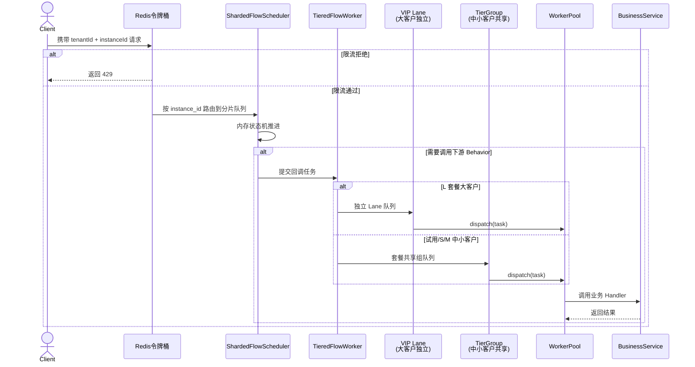

# 流程引擎资源隔离方案（重构版）

> 版本：v2.0
> 背景：流程引擎作为 SaaS 服务基座，面向多个业务方共享同一套引擎集群。本方案聚焦 ToB SaaS 场景（典型 TPS < 5000），解决"单租户异常扩散"问题，在不做独立部署的前提下实现租户级资源边界管控。
> 目标读者：技术评审、面试答辩、团队内部方案沉淀。

---

## 一、方案概述

### 1.1 核心问题

多个租户共用一套流程引擎集群。早期的隔离能力比较硬编码（配额写在配置文件、限流阈值全局固定、大客户调整需要发版），无法灵活应对租户差异化需求和突发异常行为。当单个租户出现流量洪峰、Bug 死循环或下游故障时，这种粗放的隔离容易扩散为全服故障。

本方案的目标是把硬编码隔离演进为**系统化、可配置、租户级**的分层隔离体系。

### 1.2 设计原则

| 原则 | 说明 |
|------|------|
| **共享服务、分层隔离** | 不独立部署，在共享服务内部划定租户边界 |
| **准入优先** | 超限流量在入口处直接拒绝 |
| **调度公平** | 分片 EventLoop 不能被单租户垄断，多分片并行扩展 |
| **执行隔离** | 大客户独立 Lane + 中小客户按套餐分组 + 冷租户 LRU 淘汰 |
| **实例配额与死实例防护** | 单租户未完成实例数监控 + 软限制告警 + 硬限制兜底 |
| **熔断兜底** | 单租户异常时不影响其他租户 |
| **快速失败、人工介入** | 业务体量可预估，超出预期外的事情都应该被视作失败。快速拒绝让调用方感知并决策，不自动重试掩盖问题。极端情况靠水平扩容解决，不靠重试兜底。 |

### 1.3 方案范围

本方案包含**两层能力**，共同构成完整的租户隔离体系：

| 层级 | 定位 | 交付节奏 |
|------|------|---------|
| **L1（核心隔离）** | 租户边界建立：限流、调度隔离、执行隔离、配额、熔断 | 第一阶段交付 |
| **L2（高可用保障）** | 故障恢复与运维能力：优雅关闭、节点超时告警、配置热更新、Worker 弹性 | 第二阶段交付 |
| **L3（远期演进）** | 突破单集群瓶颈：分库分表、事件溯源、Serverless、动态分片 | 视业务规模启动，方案末尾说明 |

**L1 + L2 合在一起是本方案的完整设计**，不是可选优化。L3 是超出当前方案范围的远期方向。

### 1.4 核心结论

> **多租户隔离的核心不是复制服务，而是在共享服务内部建立租户边界。L1 建立边界，L2 保障边界在故障下仍然可靠。**

---

## 二、整体架构

```
用户请求
   ↓
Nginx（按 instance_id 一致性哈希路由）
   ↓
┌─────────────────────────────────────────────────┐
│               流程引擎服务                        │
│  ┌───────────────────────────────────────────┐  │
│  │ ① 入口层：Redis 令牌桶限流                 │  │
│  │    · 租户级 QPS 限制                       │  │
│  │    · Redis 集群化 + 本地降级                │  │
│  │    · 本地令牌桶 + Redis 异步同步            │  │
│  └───────────────────────────────────────────┘  │
│  ┌───────────────────────────────────────────┐  │
│  │ ② 调度层：ShardedFlowScheduler             │  │
│  │    · 分片 EventLoop Group                  │  │
│  │    · 租户独立队列 + 公平轮询                │  │
│  │    · 状态变更同步写 DB（主键更新 + 行锁）    │  │
│  │    · 节点超时告警 + 人工介入                 │  │
│  │    · 按实例分组 + 索引优化                   │  │
│  │    · Scheduler Loop 守护 + 健康检查         │  │
│  └───────────────────────────────────────────┘  │
│  ┌───────────────────────────────────────────┐  │
│  │ ③ 执行层：TieredFlowWorker                 │  │
│  │    · 大客户（L 套餐）独立 TenantLane       │  │
│  │    · 中小客户按套餐分组共享资源池           │  │
│  │    · 冷租户 LRU 自动淘汰（30 分钟）        │  │
│  │    · 快速失败 + 监控告警                     │  │
│  │    · Resilience4j Behavior 熔断            │  │
│  │    · Worker 独立扩缩容 / 按租户分组         │  │
│  └───────────────────────────────────────────┘  │
│  ┌───────────────────────────────────────────┐  │
│  │ ④ 实例配额层：TenantInstanceQuota           │  │
│  │    · 单租户未完成实例监控                   │  │
│  │    · 软限制告警 + 硬限制兜底               │  │
│  │    · 死实例自动归档                        │  │
│  │    · 套餐化配置（试用/S/M/L）              │  │
│  │    · 优雅关闭 + 节点超时告警                 │  │
│  └───────────────────────────────────────────┘  │
│  ┌───────────────────────────────────────────┐  │
│  │ ⑤ 熔断兜底：TenantCircuitBreaker           │  │
│  │    · 自动熔断（错误率/创建速率）            │  │
│  │    · 分级熔断（创建/推进/查询）             │  │
│  │    · 半开自动恢复 + 人工一键重置            │  │
│  └───────────────────────────────────────────┘  │
│  ┌───────────────────────────────────────────┐  │
│  │ ⑥ 配置与可观测                             │  │
│  │    · 配置中心热更新                        │  │
│  │    · 租户级监控指标 + 动态告警              │  │
│  └───────────────────────────────────────────┘  │
└─────────────────────────────────────────────────┘
   ↓
Dubbo 双向 RPC
   ↓
┌─────────────────────────────────────────┐
│           业务服务（执行器）              │
│  · SDK 自动暴露 FlowTaskExecutor        │
│  · SDK 自动引用 FlowEngineCallback      │
│  · 业务方只写 Handler，SDK 自动回调      │
└─────────────────────────────────────────┘
```

---

## 三、关键技术点澄清

### 3.1 EventLoop 不是空转，也不是全局单线程

```java
public class ShardedSchedulerLoop implements Runnable {
    
    private final int shardId;
    private final BlockingQueue<FlowEvent> eventQueue = new LinkedBlockingQueue<>();
    private volatile boolean running = true;
    
    @Override
    public void run() {
        while (running) {
            try {
                // take() 阻塞等待，没事件时线程挂起，CPU 接近 0
                FlowEvent event = eventQueue.take();
                processEvent(event);
            } catch (InterruptedException e) {
                Thread.currentThread().interrupt();
                break;
            }
        }
    }
    
    private void processEvent(FlowEvent event) {
        // 1. 纯内存状态机推进（快，不阻塞）
        TransitionCommand cmd = stateMachine.compute(event);
        if (cmd == null) return;
        
        // 2. 需要调用下游 Behavior 时，提交到执行层线程池
        if (cmd.needCallback()) {
            flowWorker.submit(cmd.getTenantId(), cmd.toCallbackTask());
        }
    }
}
```

**关键点**：

1. **`while(true)` 不等于空转**。`BlockingQueue.take()` 会阻塞线程，和 Netty EventLoop 模型一致。
2. **不是全局单线程**。整个引擎有 N 个 EventLoop（通常 `shardCount = CPU 核心数`），按 `instance_id` 哈希分片，每个分片一个 EventLoop，彼此之间完全并行。
3. **EventLoop 只做轻量内存操作**：DAG 遍历、状态机计算、事件路由。DB 写入和 Dubbo 调用都移出 EventLoop，避免像 Netty 把业务逻辑交给 worker 线程一样阻塞调度。
4. **入口限流 + 租户熔断是分片饱和的第一道防线**：异常流量在入口处拦截，不进入调度层。

### 3.2 回调引擎是 SDK 自动完成的

业务方只写 Handler，不需要写回调代码。

```java
// 业务方代码
@FlowHandler(nodeType = "smsNotify")
public class SmsNotifyHandler implements FlowHandler {
    @Override
    public Object execute(Map<String, Object> input) {
        smsService.send(input.get("phone"));
        return "success";  // 只返回结果
    }
}
```

SDK 内部自动完成：
1. 暴露 `FlowTaskExecutor` Dubbo 接口
2. 执行 Handler
3. 调用引擎的 `FlowEngineCallback`

### 3.3 执行层分层隔离模型

本方案不采用"每租户独立队列"的简单方案（租户数多时内存开销不可接受），也不采用"全局线程池 + 租户 Semaphore"的方案（共享队列可能被集体打满）。

而是采用**分层隔离**：

| 租户类型 | 隔离方式 | 说明 |
|---------|---------|------|
| L 套餐大客户 | 独立 TenantLane | 每租户独立队列 + Semaphore，精细化管控 |
| 试用/S/M 中小客户 | 按套餐分组共享 | 同套餐共享资源池，组内计数器防止单租户垄断 |
| 冷租户（30 分钟不活跃） | LRU 自动淘汰 | 释放内存，下次访问时重建，对业务无感知 |

**为什么不全部用独立队列？**

每个租户一个队列 + Semaphore，租户数超过 200 时内存和监控开销不可接受。大部分中小客户流量低，独立队列利用率很低。

**为什么不用全局共享队列？**

```java
// 隐患：任务拿到 Semaphore 后仍进入共享队列
// A、B、C 同时提交任务，共享队列可能在某一刻被集体打满
// 正常租户 D 提交时也会 Rejected，且无法预判何时会爆
```

分层隔离兼顾了隔离性和资源效率：大客户精细化，中小客户共享但有组内公平，冷租户自动回收。

### 3.5 失败后的策略

**设计原则**：业务体量可预估，资源配置可提前规划。超出预期外的事情都应该被视作失败，快速拒绝让调用方感知并决策，不自动重试掩盖问题。

| 失败原因 | 处理策略 |
|---------|---------|
| 大客户队列已满 | 快速失败（返回租户过载）+ 监控告警 |
| 中小客户共享组队列已满 | 快速失败（返回套餐过载）+ 监控告警 |
| 组内单租户超限 | 拒绝该租户，同组其他租户不受影响 |
| Semaphore 满 | 任务在队列中排队等待，不直接失败 |
| Behavior 下游故障 | 熔断 + 降级 |
| 租户级熔断触发 | 分级拒绝：CREATE 拒绝，TRANSITION/QUERY 放行 + 半开自动恢复 |
| Redis 限流失效 | 降级为本地限流 |
| 全局 Worker 池饱和 | 快速失败（返回系统过载）+ 监控告警 + 人工扩容 |
| 节点执行超时 | 标记 TIMEOUT + 告警 + 人工介入 |

> **流程引擎兜底原则**：流程引擎是状态机驱动的异步系统，单个状态变更请求允许快速失败。超出预期的异常不自动重试，让调用方（上游服务或人工）感知并决策。

### 3.6 节点执行状态记录

流程引擎通过 `flow_node_execution` 表记录每个节点的执行状态，包括调用时间、回调时间、超时时间。这是超时检测和人工介入的基础。

#### 节点执行记录表

```sql
CREATE TABLE flow_node_execution (
    id VARCHAR(64) PRIMARY KEY,
    instance_id VARCHAR(64) NOT NULL,
    node_id VARCHAR(64) NOT NULL,
    status ENUM('PENDING', 'DISPATCHED', 'COMPLETED', 'TIMEOUT') NOT NULL,
    dispatched_at DATETIME,
    callback_at DATETIME,
    timeout_seconds INT NOT NULL,
    callback_result TEXT,
    INDEX idx_instance (instance_id),
    INDEX idx_status_dispatched (status, dispatched_at)
);
```

#### 状态流转

```
PENDING → DISPATCHED → COMPLETED（正常流程）
                    ↘ TIMEOUT（超时，人工介入）
```

| 状态 | 含义 | 触发条件 |
|------|------|---------|
| PENDING | 等待派发 | 节点创建 |
| DISPATCHED | 已派发，等待回调 | 调用下游服务 |
| COMPLETED | 已完成 | 收到回调 |
| TIMEOUT | 已超时 | 超过 timeout_seconds 未收到回调 |

#### 业务 Handler 代码示例

```java
@FlowHandler(nodeType = "smsNotify")
public class SmsNotifyHandler implements FlowHandler {
    @Override
    public Object execute(Map<String, Object> input) {
        smsService.send(input.get("phone"));  // 普通业务代码，无需幂等处理
        return "success";
    }
}
```

#### 关键设计

- **引擎只记录事实**：调用时间、回调时间、超时时间，不猜测、不自动恢复。
- **超时 = 业务异常**：超时率极低（< 0.1%），一旦出现必然是基础设施故障或下游服务 BUG，需要人工介入。
- **不自动重试**：自动重试会掩盖问题，让 BUG 更难定位；基础设施故障时重试无效，只会加重负载。
- **人工操作入口**：超时后提供重试/跳过/终止操作，由运维或业务方决定处理方式。

---

## 四、分层隔离实现

### 4.1 入口层：Redis 集中式令牌桶

入口限流作为第一道防线，采用 Redis + Lua 令牌桶实现跨机器共享的租户级 QPS 限制。

```java
@Component
public class RedisTenantRateLimiter {

    private static final String KEY_PREFIX = "flow:rate:bucket:";

    public boolean tryAcquire(String tenantId, int qps) {
        String lua = buildTokenBucketLua();
        Long result = redisTemplate.execute(
            new DefaultRedisScript<>(lua, Long.class),
            Collections.singletonList(KEY_PREFIX + tenantId),
            String.valueOf(qps),
            String.valueOf(qps * 2),
            String.valueOf(System.currentTimeMillis())
        );
        return result != null && result == 1L;
    }
}
```

**实现要点**：

- Redis 部署为集群模式（Cluster / Sentinel），避免单点；
- 限流 key 按 `tenant_id` 维度设计，避免热 key 集中在单个 slot；
- 本地降级：Redis 不可用时降级为本地令牌桶（Guava RateLimiter），保证限流不中断；
- 本地令牌桶 + Redis 异步同步：每次请求先走本地令牌桶（微秒级），异步将消费结果同步到 Redis，将限流 RTT 从 2ms+ 降到微秒级。适用于引擎集群总 TPS 超过几万的场景。
```

### 4.2 调度层：ShardedFlowScheduler + 租户独立队列 + 公平轮询

```java
public class ShardedFlowScheduler {
    
    private final int shardCount;
    private final EventLoop[] eventLoops;
    
    public ShardedFlowScheduler(int shardCount) {
        this.shardCount = shardCount;
        this.eventLoops = new EventLoop[shardCount];
        for (int i = 0; i < shardCount; i++) {
            eventLoops[i] = new EventLoop(i);
            eventLoops[i].start();
        }
    }
    
    /**
     * 按 instance_id 哈希路由到固定分片，保证同一实例始终由同一个 EventLoop 处理，
     * 避免分布式锁冲突，同时让多个 EventLoop 并行工作。
     */
    public void enqueue(FlowEvent event) {
        int shard = shardFor(event.getInstanceId());
        eventLoops[shard].enqueue(event);
    }
    
    private int shardFor(String instanceId) {
        return Math.floorMod(instanceId.hashCode(), shardCount);
    }
    
    private class EventLoop implements Runnable {
        
        private final int shardId;
        // 每个租户一个子队列，EventLoop 内部按租户公平轮询
        private final Map<String, LinkedBlockingQueue<FlowEvent>> tenantQueues = 
            new ConcurrentHashMap<>();
        private final BlockingQueue<FlowEvent> incomingQueue = new LinkedBlockingQueue<>();
        private final Queue<String> roundRobin = new LinkedList<>();
        private volatile boolean running = true;
        private Thread thread;
        
        void start() {
            this.thread = new Thread(this, "flow-driver-" + shardId);
            this.thread.setDaemon(true);
            this.thread.start();
        }
        
        void enqueue(FlowEvent event) {
            incomingQueue.offer(event);
        }
        
        @Override
        public void run() {
            while (running) {
                try {
                    // 1. 收取新事件并按租户分桶
                    FlowEvent incoming = incomingQueue.poll(10, TimeUnit.MILLISECONDS);
                    if (incoming != null) {
                        tenantQueues.computeIfAbsent(incoming.getTenantId(), k -> {
                            roundRobin.offer(k);
                            return new LinkedBlockingQueue<>();
                        }).offer(incoming);
                    }
                    
                    // 2. 公平轮询：每次从下一个租户队列取一个事件
                    FlowEvent event = pollFair();
                    if (event != null) {
                        processEvent(event);
                    }
                } catch (InterruptedException e) {
                    Thread.currentThread().interrupt();
                    break;
                }
            }
        }
        
        private FlowEvent pollFair() {
            int size = roundRobin.size();
            for (int i = 0; i < size; i++) {
                String tenantId = roundRobin.poll();
                if (tenantId == null) return null;
                
                LinkedBlockingQueue<FlowEvent> queue = tenantQueues.get(tenantId);
                FlowEvent event = queue != null ? queue.poll() : null;
                roundRobin.offer(tenantId);  // 放到队尾，下次轮询
                
                if (event != null) return event;
            }
            return null;
        }
        
        private void processEvent(FlowEvent event) {
            // 1. 纯内存状态机推进：DAG 遍历、条件判断、下一节点计算
            TransitionCommand cmd = stateMachine.compute(event);
            if (cmd == null) return;

            // 2. 同步写 DB（主键更新，行锁保证并发安全）
            flowInstanceRepo.transition(cmd);

            // 3. 需要调用下游 Behavior 时，提交到 TieredFlowWorker
            if (cmd.needCallback()) {
                flowWorker.submit(cmd.getTenantId(), cmd.toCallbackTask());
            }
        }
    }
}
```

**关键设计**：

- **按 `instance_id` 分片**：同一流程实例的所有事件永远路由到同一个 EventLoop，天然保证实例级串行化，不需要分布式锁。
- **多分片并行**：`shardCount` 通常设置为 CPU 核心数或 `CPU * 2`，整体调度能力随核心数水平扩展。
- **EventLoop 只做内存状态机**：DB 写入、Dubbo 调用等重活全部移出，避免阻塞调度。
- **租户公平轮询**：每个 EventLoop 内部仍按租户独立子队列 + 公平轮询，防止单个租户垄断本分片的调度。

#### 状态变更持久化：DB 主键更新 + 节点超时告警

状态变更采用**同步写 DB**，保证状态不丢失。节点执行结果通过回调接收，超时视为业务异常，由人工介入处理。

**核心思路**：DB 本身就是持久层。根据主键 ID 更新状态字段，InnoDB 行锁保证并发安全，单机轻松支撑几万 TPS。

```java
private void processEvent(FlowEvent event) {
    // 1. 纯内存状态机推进（快，不阻塞）
    TransitionCommand cmd = stateMachine.compute(event);
    if (cmd == null) return;

    // 2. 同步写 DB（主键更新，行锁保证并发安全）
    int affected = flowInstanceRepo.transition(
        cmd.getInstanceId(),
        cmd.getCurrentStatus(),  // WHERE status = currentStatus（乐观锁）
        cmd.getTargetStatus(),
        cmd.getVersion()
    );

    if (affected == 0) {
        // 状态已被其他线程变更，跳过
        return;
    }

    // 3. 更新内存缓存（立即可见）
    instanceCache.put(cmd.getInstanceId(), cmd.getNewState());

    // 4. 需要调用下游时，记录节点执行信息并派发
    if (cmd.needCallback()) {
        FlowNodeExecution node = createNodeExecution(cmd);
        node.setDispatchedAt(LocalDateTime.now());
        node.setTimeoutSeconds(cmd.getNodeConfig().getTimeout());
        nodeExecutionRepo.save(node);
        flowWorker.submit(cmd.getTenantId(), cmd.toCallbackTask());
    }
}
```

**SQL 实现**：

```sql
-- 主键更新 + 乐观锁，行锁粒度最小，冲突概率极低
UPDATE flow_instance
SET status = #{targetStatus},
    current_node = #{currentNode},
    version = version + 1,
    updated_at = NOW()
WHERE id = #{instanceId}
  AND status = #{currentStatus}
  AND version = #{version}
```

**节点执行记录**：

```sql
CREATE TABLE flow_node_execution (
    id VARCHAR(64) PRIMARY KEY,
    instance_id VARCHAR(64) NOT NULL,
    node_id VARCHAR(64) NOT NULL,
    status ENUM('PENDING', 'DISPATCHED', 'COMPLETED', 'TIMEOUT') NOT NULL,
    dispatched_at DATETIME,
    callback_at DATETIME,
    timeout_seconds INT NOT NULL,
    callback_result TEXT,
    INDEX idx_instance (instance_id),
    INDEX idx_status_dispatched (status, dispatched_at)
);
```

**节点超时告警**：

```java
@Component
public class NodeTimeoutAlerter {

    @Scheduled(fixedRate = 5000)  // 5秒扫描一次
    public void alertTimeouts() {
        // 查询已超时的节点
        List<FlowNodeExecution> timeouts = nodeExecutionRepo.findTimeoutNodes(
            DISPATCHED,
            LocalDateTime.now().minusSeconds(30)  // 默认超时 30 秒
        );

        for (FlowNodeExecution node : timeouts) {
            node.setStatus(TIMEOUT);
            nodeExecutionRepo.updateStatus(node.getId(), TIMEOUT);
            alarmService.sendCritical(String.format(
                "节点超时: instance=%s, node=%s, dispatched=%s, timeout=%ds",
                node.getInstanceId(), node.getNodeId(),
                node.getDispatchedAt(), node.getTimeoutSeconds()
            ));
        }
    }
}
```

**回调处理**：

```java
public void callback(String instanceId, String nodeId, Object result) {
    FlowNodeExecution node = nodeExecutionRepo.findByInstanceAndNode(instanceId, nodeId);

    if (node == null || node.getStatus() != DISPATCHED) {
        log.warn("无效回调: instance={}, node={}", instanceId, nodeId);
        return;
    }

    node.setCallbackAt(LocalDateTime.now());
    node.setCallbackResult(JSON.toJSONString(result));
    node.setStatus(COMPLETED);
    nodeExecutionRepo.update(node);

    // 继续推进流程
    flowScheduler.enqueue(new FlowEvent(instanceId, getTenantId(instanceId)));
}
```

**关键点**：

- **主键更新是同步的**，状态不会丢。根据主键更新 + `AND status = currentStatus` 是天然的乐观锁，并发更新时只有一个成功，其余 `affected rows = 0`。
- **行锁安全**：InnoDB 主键更新走聚簇索引，锁粒度最小，不会死锁（单表按主键顺序更新）。
- **节点超时 = 业务异常**：超时率极低（< 0.1%），一旦出现必然是基础设施故障或下游服务 BUG，需要人工介入修复，自动重试会掩盖问题。
- **引擎只记录事实**：调用时间、回调时间、超时时间，不猜测、不自动恢复。
- **人工操作入口**：超时后提供重试/跳过/终止操作，由运维或业务方决定处理方式。
- **索引优化**：`flow_node_execution` 表按 `(status, dispatched_at)` 建立联合索引，超时查询走索引范围查询。
- **不需要定时扫描兜底**：状态变更已同步落盘，不存在丢失问题。超时是业务信号，不是技术故障。

#### 读写一致性问题

状态变更为同步写 DB，不存在异步写入的滞后问题。DB 中的数据始终是最新状态。

| 查询场景 | 一致性要求 | 解决方案 |
|---------|----------|---------|
| 流程推进 / 回调触发 | 强一致 | 直接读 DB，数据已落盘 |
| 可视化页面查看流程状态 | 强一致 | 直接读 DB，无滞后 |
| 审计 / 对账 / 报表 | 强一致 | 直接读 DB |

**内存缓存（可选优化）**：

```java
@Component
public class FlowInstanceQueryService {

    @Autowired
    private FlowInstanceRepository flowInstanceRepo;

    @Autowired
    private InstanceMemoryCache instanceCache;  // LRU 缓存，容量可控

    public FlowInstanceDTO getInstance(String instanceId) {
        // 1. 先查内存缓存（状态机推进时同步更新缓存）
        FlowInstance cached = instanceCache.get(instanceId);
        if (cached != null) {
            return toDTO(cached);
        }

        // 2. 缓存 miss，查 DB（数据已落盘，强一致）
        FlowInstance fromDb = flowInstanceRepo.findById(instanceId);
        return toDTO(fromDb);
    }
}
```

**关键点**：

- 状态变更为同步写 DB，不存在"内存已推进但 DB 未落盘"的一致性问题；
- 内存缓存是可选的性能优化（减少 DB 查询），不是一致性保障机制；
- 缓存容量按实例热度控制，冷实例自动淘汰，不影响内存占用。

#### Scheduler 高可用守护

每个分片 EventLoop 都是单线程运行的，一旦线程异常退出或卡死，对应分片的所有实例推进都会停止。因此每个 Scheduler Loop 都必须有独立守护，作为调度层的默认高可用机制。

| 保障机制 | 作用 | 实现方式 |
|---------|------|---------|
| 异常捕获 | 单条事件异常不退出 Loop | `try-catch` 包裹循环体 |
| 异常退出重建 | 线程异常终止后自动重建 | `UncaughtExceptionHandler` 中重新 `start()` |
| 看门狗 | 检测 Loop 卡死 | 独立线程定期检查 `processed` 计数是否增长 |
| 健康检查 | 供 LB / K8s 探针使用 | `/health` 返回各分片心跳 |

```java
public class GuardedScheduler {
    private final int shardId;
    private final AtomicLong processed = new AtomicLong(0);
    private volatile Thread eventLoopThread;
    private final FlowScheduler scheduler;
    private final AlarmService alarmService;
    
    public GuardedScheduler(int shardId, FlowScheduler scheduler, AlarmService alarmService) {
        this.shardId = shardId;
        this.scheduler = scheduler;
        this.alarmService = alarmService;
    }
    
    public void start() {
        eventLoopThread = new Thread(this::loop, "flow-scheduler-" + shardId);
        eventLoopThread.setUncaughtExceptionHandler((t, e) -> {
            alarmService.sendCritical("分片 " + shardId + " Scheduler Loop 异常退出", e);
            start(); // 重建
        });
        eventLoopThread.start();
        
        // 看门狗：检测卡死
        Executors.newSingleThreadScheduledExecutor(r -> new Thread(r, "flow-scheduler-watchdog-" + shardId))
            .scheduleAtFixedRate(() -> {
                long before = processed.get();
                LockSupport.parkNanos(2_000_000_000L);
                if (processed.get() == before && eventLoopThread.isAlive()) {
                    alarmService.warn("分片 " + shardId + " Scheduler Loop 可能卡死");
                }
            }, 10, 10, TimeUnit.SECONDS);
    }
    
    private void loop() {
        while (running) {
            try {
                scheduler.runOneIteration();
                processed.incrementAndGet();
            } catch (Exception e) {
                alarmService.sendCritical("分片 " + shardId + " Scheduler 处理事件异常", e);
                // 不退出 Loop，继续消费下一条
            }
        }
    }
    
    public Health health() {
        return eventLoopThread != null && eventLoopThread.isAlive()
            ? Health.up().withDetail("shard", shardId).build()
            : Health.down().withDetail("shard", shardId).build();
    }
}
```

**关键点**：

- 异常不扩散：单条事件异常被捕获，不影响同分片其他事件。
- 自动恢复：线程异常退出时 `UncaughtExceptionHandler` 自动重建。
- 可观测：`processed` 计数和心跳为监控告警提供数据。
- 这是调度层的默认实现，不是可选优化。

### 4.3 执行层：分层隔离 + LRU 淘汰 + Behavior 熔断

传统"共享线程池 + 租户 Semaphore"的方案有一个隐患：任务即使拿到 Semaphore，也会先进入共享线程池队列。多个租户同时提交时，共享队列可能在某个时刻被集体打满，导致正常租户也被拒绝，且无法预判何时会爆。

因此采用**分层隔离**模型：大客户（L 套餐）独立 TenantLane 精细化管控，中小客户按套餐分组共享资源池，冷租户 LRU 自动淘汰释放内存。

#### 整体结构

```
TieredFlowWorker
├── VIP Lanes（L 套餐大客户，每租户独立队列 + Semaphore）
├── Tier Groups（试用/S/M 套餐，按等级共享资源池）
│   ├── Trial Group（共享队列 + 组内计数器）
│   ├── S Group
│   └── M Group
└── LRU Eviction（30 分钟不活跃自动淘汰，下次访问重建）
```

#### 核心实现

```java
public class TieredFlowWorker {

    private final ThreadPoolExecutor workerPool;

    // 大客户：独立 TenantLane，精细化隔离
    private final LinkedHashMap<String, TenantLane> vipLanes =
        new LinkedHashMap<String, TenantLane>(100, 0.75f, true) {
            @Override
            protected boolean removeEldestEntry(Map.Entry<String, TenantLane> eldest) {
                TenantLane lane = eldest.getValue();
                if (!lane.queue.isEmpty() || lane.activeTasks > 0) return false;
                return size() > MAX_VIP_LANES;
            }
        };

    // 中小客户：按套餐分组共享资源池
    private final Map<String, TierGroup> tierGroups = new ConcurrentHashMap<>();

    private static final int MAX_VIP_LANES = 200;
    private static final long EVICT_AFTER_IDLE_MS = 30 * 60 * 1000;

    public boolean submit(String tenantId, Runnable task) {
        TenantTier tier = tenantConfigService.getTier(tenantId);

        if (tier == TenantTier.L) {
            // 大客户：独立 Lane
            return submitToVipLane(tenantId, task);
        } else {
            // 中小客户：按套餐分组
            return submitToTierGroup(tier, tenantId, task);
        }
    }

    // ── 大客户路径 ──

    private boolean submitToVipLane(String tenantId, Runnable task) {
        TenantLane lane;
        synchronized (vipLanes) {
            lane = vipLanes.computeIfAbsent(tenantId, k -> createVipLane(tenantId));
        }
        lane.lastAccessTime = System.currentTimeMillis();

        if (!lane.queue.offer(task)) {
            throw new TenantQueueFullException(tenantId);
        }
        dispatch(lane);
        return true;
    }

    private TenantLane createVipLane(String tenantId) {
        int limit = tenantConfigService.getConcurrencyLimit(tenantId);
        int queueSize = tenantConfigService.getQueueSize(tenantId);
        return new TenantLane(tenantId, new LinkedBlockingDeque<>(queueSize), new Semaphore(limit));
    }

    // ── 中小客户路径 ──

    private boolean submitToTierGroup(TenantTier tier, String tenantId, Runnable task) {
        TierGroup group = tierGroups.computeIfAbsent(tier.name(), k -> createGroup(tier));

        // 组内按租户计数，防止单租户垄断组内资源
        int tenantUsage = group.tenantCounter.incrementAndGet(tenantId);
        if (tenantUsage > group.perTenantLimit) {
            group.tenantCounter.decrementAndGet(tenantId);
            throw new TenantQuotaException(tenantId);
        }

        if (!group.queue.offer(task)) {
            group.tenantCounter.decrementAndGet(tenantId);
            throw new TenantQueueFullException(tenantId);
        }
        dispatch(group);
        return true;
    }

    private TierGroup createGroup(TenantTier tier) {
        TierConfig config = tenantConfigService.getTierConfig(tier);
        return new TierGroup(
            tier,
            new LinkedBlockingDeque<>(config.queueSize),
            new Semaphore(config.concurrency),
            config.perTenantLimit
        );
    }

    // ── 调度与执行 ──

    private void dispatch(Object laneOrGroup) {
        Semaphore semaphore = getSemaphore(laneOrGroup);
        if (!semaphore.tryAcquire()) return;

        Runnable task = pollTask(laneOrGroup);
        if (task == null) {
            semaphore.release();
            return;
        }
        workerPool.execute(new TaskWrapper(laneOrGroup, task));
    }

    // ── LRU 淘汰 ──

    @Scheduled(fixedRate = 60_000)
    public void evictIdleLanes() {
        long now = System.currentTimeMillis();
        synchronized (vipLanes) {
            vipLanes.entrySet().removeIf(entry -> {
                TenantLane lane = entry.getValue();
                boolean idle = lane.queue.isEmpty()
                    && lane.activeTasks == 0
                    && now - lane.lastAccessTime > EVICT_AFTER_IDLE_MS;
                if (idle) log.info("淘汰空闲大客户 Lane: {}", entry.getKey());
                return idle;
            });
        }
    }

    // ── 数据结构 ──

    static class TenantLane {
        final String tenantId;
        final LinkedBlockingDeque<Runnable> queue;
        final Semaphore semaphore;
        final int maxConcurrency;
        volatile long lastAccessTime;
        volatile int activeTasks;

        TenantLane(String tenantId, LinkedBlockingDeque<Runnable> queue, Semaphore semaphore) {
            this.tenantId = tenantId;
            this.queue = queue;
            this.semaphore = semaphore;
            this.maxConcurrency = semaphore.availablePermits();
            this.lastAccessTime = System.currentTimeMillis();
        }
    }

    static class TierGroup {
        final TenantTier tier;
        final LinkedBlockingDeque<Runnable> queue;
        final Semaphore semaphore;
        final int perTenantLimit;
        final ConcurrentHashMap<String, AtomicInteger> tenantCounter = new ConcurrentHashMap<>();

        TierGroup(TenantTier tier, LinkedBlockingDeque<Runnable> queue, Semaphore semaphore, int perTenantLimit) {
            this.tier = tier;
            this.queue = queue;
            this.semaphore = semaphore;
            this.perTenantLimit = perTenantLimit;
        }
    }

    // ── Worker 任务包装 ──

    class TaskWrapper implements Runnable {
        final Object laneOrGroup;
        final Runnable firstTask;

        TaskWrapper(Object laneOrGroup, Runnable firstTask) {
            this.laneOrGroup = laneOrGroup;
            this.firstTask = firstTask;
        }

        @Override
        public void run() {
            Runnable task = firstTask;
            while (task != null) {
                try {
                    task.run();
                } catch (Exception e) {
                    log.error("任务执行异常", e);
                } finally {
                    releaseTask(laneOrGroup);
                }
                if (!tryAcquireAndPoll(laneOrGroup)) break;
                task = pollCurrentTask();
            }
        }
    }
}
```

**分层策略对比**：

| 维度 | L 套餐大客户 | 试用/S/M 中小客户 |
|------|------------|----------------|
| 隔离粒度 | 每租户独立 Lane | 按套餐分组共享 |
| 队列深度 | 租户级可配置 | 套餐级统一配置 |
| 并发上限 | 租户级 Semaphore | 组内 Semaphore + 租户计数器 |
| 内存管理 | LRU 自动淘汰（30 分钟不活跃） | 固定 4 个组，无动态开销 |
| 适用租户数 | 大客户通常 < 50 | 中小客户可数百 |

#### 执行时序



#### Worker 池自定义拒绝策略

分层隔离已大幅降低 Worker 池饱和概率，但仍配置自定义拒绝策略作为最后兜底。

**设计原则**：业务体量可预估，资源配置可提前规划。超出预期外的事情都应该被视作失败，快速拒绝让调用方感知并决策，不自动重试掩盖问题。

```java
public class FlowWorkerRejectPolicy implements RejectedExecutionHandler {

    private final TieredFlowWorker flowWorker;
    private final AlarmService alarmService;

    @Override
    public void rejectedExecution(Runnable r, ThreadPoolExecutor executor) {
        if (r instanceof TieredFlowWorker.TaskWrapper wrapper) {
            // 1. 释放 Semaphore
            Object laneOrGroup = wrapper.laneOrGroup;
            Semaphore semaphore = flowWorker.getSemaphore(laneOrGroup);
            semaphore.release();

            // 2. 告警
            alarmService.sendCritical("Worker 池饱和，任务被拒绝");

            // 3. 快速失败，返回调用方
            throw new SystemOverloadException("系统繁忙，请稍后重试");
        } else {
            throw new RejectedExecutionException("Unknown task rejected");
        }
    }
}
```

**监控提前告警**：

```java
@Component
public class WorkerPoolMonitor {

    @Scheduled(fixedRate = 5000)
    public void monitor() {
        double usage = (double) workerPool.getActiveCount() / workerPool.getMaximumPoolSize();
        if (usage > 0.8) {
            alarmService.warn("Worker 池使用率: " + (int)(usage * 100) + "%，即将饱和");
        }
    }
}
```

**关键点**：
- 大客户精细化隔离，中小客户按套餐分组共享，冷租户 LRU 自动淘汰。
- 共享线程池只接收已拿到 Semaphore 的任务，不会因某个租户突发流量而集体爆队列。
- Worker 线程循环消费同一队列，避免递归调用导致栈溢出。
- **拒绝 = 快速失败**：不存表、不回队、不自动重试，让调用方感知系统过载并自行决策。
- **监控提前告警**：Worker 池使用率 > 80% 时告警，人工扩容。
- **Worker 弹性扩展**：当执行层成为瓶颈时，可将 Worker 线程池独立为单独的服务，与调度层分开扩缩容；大客户或高耗时 Behavior 使用独立 Worker 分组，避免相互影响。

### 4.4 实例配额层：实例生命周期管理与死实例防护

#### 流程实例不需要常驻内存

流程实例的完整状态持久化在 DB 中，**不默认常驻内存**。无论流程处于运行中、等待人工审批、等待外部回调还是定时触发状态，实例对象都可以在状态推进结束后从内存释放。

以人工审批节点为例：

```
1. 流程推进到人工审批节点
2. 状态机将实例状态更新为 WAITING_FOR_APPROVAL
3. 实例对象从 Scheduler 内存中移除（或仅保留在本地缓存中，可失效）
4. 当用户在界面点击"通过/拒绝"时，生成一个审批事件
5. Scheduler 从 DB 加载该实例，恢复状态机，继续推进
```

所以**人工审批节点本身不会导致内存占用**，它只是 DB 中的一条记录。

#### 那为什么还需要活跃实例上限？

活跃实例上限限制的是 **"DB 中未完成实例的总数"**，不是 "内存中对象的数量"。它的作用是：

1. **防止 DB 单表无限膨胀**：死实例（如永远无人审批、配置错误、循环创建）不断累积，导致查询和统计变慢；
2. **控制启动恢复时间**：节点重启时需要扫描未完成实例进行对账，实例越多恢复越慢；
3. **防止运营失控**：租户创建了大量"僵尸流程"，占用存储、监控、审计资源；
4. **作为业务约束**：合同约定的实例上限，超出需要购买更高套餐。

#### 真正占用内存的是什么？

| 对象 | 是否常驻内存 | 控制手段 |
|------|------------|---------|
| 流程实例完整状态 | 否，持久化到 DB | 活跃实例上限（DB 级别） |
| 热实例缓存 | 是，LRU 缓存 | 缓存大小限制、过期时间 |
| Scheduler 事件队列 | 是，等待处理的事件 | 队列深度限制 |
| Worker 线程/任务 | 是，执行中任务 | Semaphore + 线程池大小 |

#### 配额设计

```java
@Component
public class TenantInstanceQuota {
    
    public boolean tryRegister(String tenantId) {
        int softLimit = tenantConfigService.getSoftLimit(tenantId);
        int hardLimit = tenantConfigService.getHardLimit(tenantId);
        
        // 从 DB 查询该租户当前未完成实例数
        long current = flowInstanceRepo.countActiveByTenantId(tenantId);
        
        // 软限制：告警，但不拒绝
        if (current > softLimit && current <= hardLimit) {
            alarmService.warn("租户 " + tenantId + " 活跃实例数超过软限制：" + current);
        }
        
        // 硬限制：拒绝新建
        if (current > hardLimit) {
            throw new TenantQuotaException("租户活跃实例超过硬限制");
        }
        
        return true;
    }
}
```

**活跃实例定义**

套餐中的"活跃实例上限"指的是 **DB 中当前未完成实例的总数**，不是历史累计创建数，也不是单次并发数。

计入活跃实例的状态：

```sql
SELECT COUNT(*) 
FROM flow_instance 
WHERE tenant_id = 'tenant_a' 
  AND status NOT IN ('COMPLETED', 'TERMINATED', 'ARCHIVED')
```

| 状态 | 是否计入活跃实例 | 说明 |
|------|---------------|------|
| RUNNING | ✅ | 运行中 |
| WAITING_APPROVAL | ✅ | 等待人工审批 |
| WAITING_CALLBACK | ✅ | 等待外部回调 |
| SLEEP / TIMEOUT | ✅ | 定时触发中 |
| COMPLETED | ❌ | 已完成 |
| TERMINATED | ❌ | 已终止 |
| ARCHIVED | ❌ | 已归档 |

**示例**：

S 套餐活跃实例上限 1000：

- Day 1：创建 500 个流程，300 个完成，200 个在审批中 → 活跃实例 = 200
- Day 2：再创建 900 个流程，100 个完成，800 个挂起 → 活跃实例 = 200 + 800 = 1000
- Day 3：想再创建 1 个流程 → 触发上限，拒绝创建，提示"活跃实例已达套餐上限"

**配额设定原则**：

- 不基于 JVM 堆大小计算（因为实例不常驻内存）；
- 基于 **业务规模** 和 **合同约定**：试用版 100 个、S 套餐 1000 个、M 套餐 5000 个、L 套餐 20000 个；
- 配合 **自动归档策略**：MANUAL 节点挂起超过 7 天、超时超过 30 天的实例自动归档或标记为 DEAD。

**关键原则**：
- 流程实例状态持久化在 DB，内存只保留热缓存和执行中任务；
- 活跃实例上限是**数据治理 + 业务约束**，不是防止 OOM 的手段；
- 死实例必须定期清理，否则配额很快失效。

#### 优雅关闭与故障恢复

实例状态持久化在 DB 中，状态变更为同步写入，不存在丢失问题。优雅关闭保证发布、缩容时排空队列。

| 机制 | 作用 | 触发时机 |
|------|------|---------|
| 优雅关闭 | 停止接收新事件，排空所有队列（VIP Lane + 套餐共享组） | SIGTERM / 应用关闭钩子 |
| 节点超时告警 | 超时节点标记为 TIMEOUT + 告警通知 | 自动运行（5 秒间隔） |
| 回调重试 | 下游回调失败时，下游服务自行重试 | 下游服务控制 |

**优雅关闭**

```java
@Component
public class GracefulFlowShutdown implements ApplicationListener<ContextClosedEvent> {
    
    @Autowired
    private ShardedFlowScheduler shardedFlowScheduler;
    
    @Autowired
    private TieredFlowWorker flowWorker;
    
    @Override
    public void onApplicationEvent(ContextClosedEvent event) {
        // 1. 停止接收新事件
        shardedFlowScheduler.stopAccepting();
        
        // 2. 等待 EventLoop 消费完已入队事件
        shardedFlowScheduler.awaitTermination(30, TimeUnit.SECONDS);
        
        // 3. 等待 TieredFlowWorker 所有队列排空（VIP Lane + 套餐共享组）
        flowWorker.awaitTermination(60, TimeUnit.SECONDS);
    }
}
```

**故障恢复设计**

本方案不采用"自动重试/自动恢复"策略。原因：

- 超时失败率极低（< 0.1%），一旦出现必然是基础设施故障或下游服务 BUG
- 自动重试会掩盖问题，让 BUG 更难定位
- 基础设施故障时重试无效，只会加重负载
- 资源耗尽时重试会雪上加霜

**引擎职责边界**：

| 引擎负责 | 引擎不负责 |
|---------|-----------|
| 记录状态（调用时间、回调时间、超时时间） | 自动重试 |
| 判断超时（对比超时时间） | 自动恢复 |
| 标记异常 + 告警 | 猜测故障原因 |
| 提供人工操作入口 | 修复下游 BUG |

**人工操作入口**：

超时后，运维或业务方通过管理后台处理：

```
节点超时详情：
- 实例ID: flow_20260615_001
- 节点: 财务审批
- 派发时间: 10:30:00
- 超时时间: 30s
- 已等待: 5m
- 下游服务: finance-service/approve

操作：[重试] [跳过] [终止]
```

**关键点**：

- 状态变更为同步写 DB，不存在丢失问题。
- 优雅关闭超时时必须告警，说明存在执行时间过长的任务或队列积压。
- 超时是业务异常信号，不是技术故障，需要人工介入根治。
- 这是实例生命周期管理的默认实现，不是可选优化。

### 4.5 熔断兜底

流程引擎的熔断不能"一开全拒"，必须区分操作类型：

- **CREATE**：新流程实例创建，是流量入口，可以拒绝。
- **TRANSITION**：已有实例状态推进，拒绝会导致流程卡死，应尽可能放行。
- **QUERY**：只读查询，通常不消耗核心资源，应放行。

```java
@Component
public class TenantCircuitBreaker {
    
    enum State { CLOSED, OPEN, HALF_OPEN }
    enum OpType { CREATE, TRANSITION, QUERY }
    
    private final Map<String, State> tenantStates = new ConcurrentHashMap<>();
    private final Map<String, Long> openTimes = new ConcurrentHashMap<>();
    private final long halfOpenTimeoutMs = 30_000; // 30s 后尝试恢复
    
    public void autoTrip(String tenantId, MetricSnapshot snapshot) {
        if (snapshot.errorRate() > 0.9 || snapshot.createRate() > baseline * 10) {
            tenantStates.put(tenantId, State.OPEN);
            openTimes.put(tenantId, System.currentTimeMillis());
            alarmService.sendCritical("租户 " + tenantId + " 已被自动熔断");
        }
    }
    
    public boolean allow(String tenantId, OpType opType) {
        State state = tenantStates.getOrDefault(tenantId, State.CLOSED);
        
        if (state == State.CLOSED) {
            return true;
        }
        
        if (state == State.OPEN) {
            Long openTime = openTimes.get(tenantId);
            if (openTime != null 
                && System.currentTimeMillis() - openTime > halfOpenTimeoutMs) {
                // 冷却结束，进入半开状态自动试探
                tenantStates.put(tenantId, State.HALF_OPEN);
                return allow(tenantId, opType);
            }
            // 分级：只拒绝 CREATE，TRANSITION 和 QUERY 放行
            return opType != OpType.CREATE;
        }
        
        // HALF_OPEN：允许流量通过，由调用方上报 success/failure 决定后续状态
        return true;
    }
    
    public void recordSuccess(String tenantId) {
        if (tenantStates.get(tenantId) == State.HALF_OPEN) {
            tenantStates.put(tenantId, State.CLOSED);
            openTimes.remove(tenantId);
            alarmService.info("租户 " + tenantId + " 熔断自动恢复");
        }
    }
    
    public void recordFailure(String tenantId) {
        if (tenantStates.get(tenantId) == State.HALF_OPEN) {
            tenantStates.put(tenantId, State.OPEN);
            openTimes.put(tenantId, System.currentTimeMillis());
            alarmService.sendCritical("租户 " + tenantId + " 半开恢复失败，重新熔断");
        }
    }
    
    public void manualReset(String tenantId) {
        tenantStates.put(tenantId, State.CLOSED);
        openTimes.remove(tenantId);
        alarmService.info("租户 " + tenantId + " 已人工重置熔断");
    }
}
```

**关键点**：
- 熔断是**最后兜底**，不是常态。
- 已有流程实例的状态推进应优先保障，避免业务卡死。
- 自动半开恢复减少人工介入，但人工重置仍需保留。

---

## 五、技术选型说明

| 能力 | 选型 | 原因 |
|------|------|------|
| Behavior 级熔断 | Resilience4j / Sentinel | 成熟框架，直接复用 |
| 租户级 Semaphore 并发隔离 | 自研 | 动态租户、分级配额、大客户独立 Lane + 中小客户按套餐分组 + LRU 淘汰 |
| 入口限流 | Redis + Lua 自研 | 跨机器共享状态，依赖现有基础设施 |
| 调度层租户队列 | 自研 | ShardedFlowScheduler + EventLoop 模型 |
| 实例配额 | 自研 | 长周期节点（人工/等待/定时）死实例防护 |

**为什么不用 Resilience4j Bulkhead / Sentinel 做租户隔离？**

它们都是按"资源/方法"维度做信号量隔离：
- Resilience4j：`@Bulkhead(name = "paymentService")`
- Sentinel：`rule.setResource("sayHello")`

但我们要的是按"动态租户 ID + 套餐等级"维度隔离。大客户独立 Lane、中小客户按套餐分组共享、冷租户 LRU 淘汰，这种分层模型需要自研。

---

## 六、性能与瓶颈

### 6.1 关键指标

| 指标 | 健康范围 | 告警阈值 |
|------|---------|---------|
| 线程池活跃线程数 | < 80% 上限 | 80% |
| 租户队列深度 | < 80% 长度 | 80% |
| 租户 Semaphore 占用 | < 80% 上限 | 80% |
| Redis 限流 RTT | < 2ms | 5ms |
| DB 写入延迟 | < 20ms | 50ms |
| 租户错误率 | < 5% | 50% |

### 6.2 主要瓶颈与应对策略

基于当前架构（分片 FlowScheduler + 主键更新同步落盘 + 节点超时告警 + TieredFlowWorker 线程池 + 实例配额），本方案对每个瓶颈都有明确的应对策略（L1+L2）。超出方案范围的远期演进方向标注为 L3。

#### 1. DB 写入吞吐量（最核心瓶颈）

状态变更最终都要落库。虽然通过主键更新 + 行锁已是最优写入方式，但 DB 仍是上限所在：

- **行锁竞争**：同一实例的并发状态变更，通过 `AND status = currentStatus` 乐观锁保证只有一个成功；
- **磁盘 IOPS**：主键更新走聚簇索引，O(log n)，但仍受限于磁盘 IOPS；
- **索引维护**：`flow_instance` 表通常有 `tenant_id`、`status`、`updated_at` 等多个索引，高并发写入时索引维护成本高。

**本方案应对**：主键更新 + 乐观锁 + 索引优化 + 节点超时告警（4.2）。

**L3 演进**：分库分表、引入事件溯源存储（如 Kafka / 专用时序 DB）。

#### 2. Redis 限流 RTT

每次创建请求都需一次 Redis 往返（Lua 令牌桶）：

- 常规 TPS（几千以下）通常不构成瓶颈；
- 当引擎集群总 TPS 达到几万、或 Redis 为共享集群/存在单租户热 key 时，RTT 会成为延迟放大点。

**本方案应对**：Redis 集群化 + 避免热 key（4.1）；本地令牌桶 + Redis 异步同步，将 RTT 从 2ms+ 降到微秒级（4.1）。

**L3 演进**：专用限流服务。

#### 3. 下游业务调用耗时

TieredFlowWorker 调用下游业务 Handler 是主要耗时来源：

- Worker 线程池大小直接决定并发处理能力；
- 下游服务 RT 长、超时、抖动会占满线程池，影响该租户甚至全局。

**注意**：这个瓶颈不在引擎内部，而在下游服务。引擎的设计目标就是把下游调用隔离在 Worker 层，不阻塞 Scheduler。

**本方案应对**：分层隔离（大客户独立 Lane + 中小客户按套餐分组）+ Semaphore + 下游熔断，防止单租户占满全局线程池（4.3）；Worker 节点独立扩缩容、按租户/按行为拆分 Worker 分组（4.3）。

**L3 演进**：重 IO 任务 Serverless 化（如函数计算）。

#### 4. 单个 EventLoop 分片饱和

虽然整体调度能力随 `shardCount` 线性扩展，但单个分片内部仍是串行：

- 如果某个 `instance_id` 对应实例产生极高频事件（如死循环），会把所在分片的 EventLoop 占满。

**本方案应对**：入口限流拦截异常流量（4.1）+ 租户熔断兜底（4.5）+ Scheduler Loop 守护（4.2）。

**L3 演进**：动态分片 / 一致性哈希，打散热点实例。

#### 5. 状态持久化与节点超时

状态变更采用同步写 DB（主键更新 + 行锁），不存在异步写入的丢失窗口：

- 主键更新直接落盘，节点崩溃不会丢失已提交的状态变更；
- 节点执行状态通过 `flow_node_execution` 表记录（调用时间、回调时间、超时时间）；
- 超时视为业务异常，由人工介入处理，不自动重试。

**本方案应对**：主键更新同步落盘 + 节点超时告警 + 人工介入（4.2、3.6）。

**L3 演进**：Kafka / RocketMQ 作为事件缓冲，多副本保证可靠性。

#### 6. 租户队列容量配置

队列过小导致突发任务被拒绝，队列过大则积压失去时效性：

- 需按租户等级设定（试用/S/M/L）；
- 配合监控告警，根据实际数据动态调整。

**本方案应对**：套餐化配置固化队列深度（8.6）；配置中心热更新 + 按租户实时队列深度动态告警。

**L3 演进**：自适应队列，根据租户历史行为动态调整容量。

---

#### 优化路径总览

| 瓶颈 | 本方案应对（L1 + L2） | L3 演进方向 |
|------|---------------------|------------|
| DB 写入吞吐 | 主键更新 + 乐观锁 + 索引优化 + 节点超时告警（4.2） | 分库分表、事件溯源存储 |
| Redis 限流 RTT | Redis 集群化 + 本地令牌桶异步同步（4.1） | 专用限流服务 |
| 下游调用耗时 | 分层隔离 + Semaphore + 熔断 + Worker 弹性扩展（4.3） | Serverless 化重 IO 任务 |
| 分片 EventLoop 饱和 | 入口限流（4.1）+ 熔断（4.5）+ Scheduler 守护（4.2） | 动态分片 / 一致性哈希 |
| 状态持久化与节点超时 | 主键更新同步落盘 + 节点超时告警 + 人工介入（4.2、3.6） | Kafka / RocketMQ 多副本缓冲 |
| 租户队列容量 | 套餐固化配置 + 配置中心热更新 + 动态告警（8.6） | 自适应队列 |

---

#### 不算是性能瓶颈的：实例配额

实例配额限制的是 **DB 中未完成实例总数**，不是内存中的对象数量，因此它不是性能瓶颈，而是：

- **商业约束**：区分试用/S/M/L 套餐；
- **数据治理**：防止死实例无限累积导致 DB 单表膨胀；
- **运营兜底**：给运维一个可量化的治理指标。

只要配合自动归档策略，实例配额不会成为系统吞吐的瓶颈。

---

## 七、生产验证与监控

### 7.1 必做验证

1. **基线压测**：单机 TPS 拐点、线程池饱和点、DB 性能拐点
2. **单租户异常扩散演练**：单租户流量洪峰，验证其他租户不受影响
3. **故障注入**：Redis 抖动、MySQL 慢查询、下游服务超时
4. **缩容验证**：有状态服务缩容需等待存量实例完成

### 7.2 监控看板

```promql
# 租户 A 在 shard 0 上的调度队列深度
flow_driver_queue_depth{tenant_id="tenant_a", shard_id="0"}

# 各租户跨分片总队列深度
sum(flow_driver_queue_depth) by (tenant_id)

# 各租户 Semaphore 占用排行
topk(5, sum(flow_tenant_concurrency_used) by (tenant_id))

# 各租户错误率排行
topk(5, sum(rate(flow_callback_errors_total[5m])) by (tenant_id))
```

---

## 八、架构师评估

### 8.1 优点

- 成本远低于独立部署
- 运维简单，一套代码一套镜像
- 五层防护 + 熔断兜底，隔离效果完整（分层执行隔离天然支持大规模租户）
- 可渐进落地，风险可控
- 与现有 Dubbo/Redis/MySQL 技术栈契合

### 8.2 缺点

- 非绝对隔离，全局 Worker 池饱和或共享 DB 慢查询仍可能互相影响
- 配置复杂度高，需要按租户等级抽象为套餐并持续调优（套餐化配置 + 配置中心热更新已缓解）
- 依赖 Redis 可用性（本地降级已兜底）
- 动态租户多时内存 Map 需要清理
- 有状态服务缩容不灵活（优雅关闭 + 节点超时告警已覆盖）

### 8.3 适用边界

| 场景 | 是否适合 | 说明 |
|------|---------|------|
| 租户数量 < 200 | ✅ 适合 | 大客户独立 Lane + 中小客户按套餐分组 + LRU 淘汰（见 4.3） |
| 租户数量 > 200 | ✅ 适用 | 同上，中小客户共享组天然支持大规模租户 |
| 强合规隔离要求 | ❌ 需独立部署 | 法规要求物理隔离 |
| 大客户流量百倍差异 | ✅ 已覆盖 | L 套餐大客户独立 TenantLane + 独立 Worker 分组 |

执行层采用分层隔离模型（4.3）：大客户独立 Lane 精细化管控，中小客户按套餐分组共享资源池，冷租户 LRU 自动淘汰。该模型天然支持大规模租户——中小客户共享组数量固定（4 个），不随租户数增长。

### 8.4 剩余风险与建议

| 风险 | 等级 | 状态 | 建议 |
|------|------|------|------|
| 单个分片 EventLoop 线程故障 | 中 | **已解决** ✅ | Scheduler 守护线程 + 健康检查（4.2） |
| 节点崩溃丢内存状态 | 中 | **已覆盖** ✅ | 主键更新同步落盘，状态不丢失（4.2） |
| 动态 Map 内存泄漏 | 中 | **已解决** ✅ | LRU 自动淘汰冷租户 Lane + 按套餐分组共享资源池（4.3） |
| 配置调优复杂 | 中 | **已解决** ✅ | 套餐化配置（8.6）+ 配置中心热更新 |
| Worker 池 RejectedExecution | 低 | **已解决** ✅ | 快速失败 + 监控告警 + 人工扩容（4.3） |
| 共享 DB 慢查询/热 key | 低 | 待处理 | 加强 SQL 慢查询监控和 TopN 租户告警 |

### 8.5 节点故障恢复的高可用演进方向

本方案已覆盖完整的故障恢复链路：Scheduler 守护（4.2）→ 优雅关闭（4.4）→ 主键更新同步落盘（4.2）→ 节点超时告警 + 人工介入（3.6）。若业务对可用性有更高要求（如要求秒级故障转移），可进一步演进为 L3。

#### L3：事件消息队列 + 实例租约（高可用，高成本）

- **事件消息队列**：关键事件先写 Kafka / RocketMQ，再进入内存队列；重启后从消息队列重放。
- **实例租约**：每个节点为负责的实例维持心跳租约；节点故障后，租约过期，其他节点接管。
- **事件去重**：消息队列重放或租约接管时，根据事件 ID 幂等去重。

### 8.6 租户配置套餐化

为降低配置调优复杂度，将租户配置抽象为**四级内置套餐**，避免为每个租户单独配置所有参数。

| 配置项 | 试用版 | S 套餐（基础版） | M 套餐（标准版） | L 套餐（企业版） |
|--------|--------|----------------|----------------|----------------|
| 适用对象 | POC / 试用租户 | 小客户 | 中型客户 | 大客户 / 核心客户 |
| QPS 限制 | 10/s | 50/s | 200/s | 1000/s |
| 租户队列深度 | 50 | 100 | 500 | 2000 |
| Semaphore 并发上限 | 2 | 5 | 20 | 50 |
| 活跃实例软限制 | 50 | 500 | 2000 | 8000 |
| 活跃实例硬限制 | 100 | 1000 | 4000 | 15000 |

> **活跃实例定义**：当前未完成实例总数，即 DB 中 `status NOT IN ('COMPLETED', 'TERMINATED', 'ARCHIVED')` 的实例数。

**使用规则**：
- 新租户默认接入**试用版**（如 14 天试用期），到期后根据合同升级到 S / M / L；
- 根据业务体量、合同 SLA 升级到更高套餐；
- 超大规模客户可单独定制，但运营侧尽量不开放逐参数配置，减少配置漂移和运维负担。

---

## 九、落地计划

本方案分两阶段交付，合计 6 周。第一阶段建立租户边界，第二阶段补齐高可用与运维能力。两阶段合在一起构成完整方案。

### 第一阶段（2 周）：核心隔离层

> 目标：共享服务内建立完整的租户边界，单租户异常不扩散。

| 模块 | 交付项 | 对应章节 | 验收标准 |
|------|--------|---------|---------|
| **入口限流** | Redis 令牌桶 + 集群化部署 + 本地降级 | 4.1 | 单租户超限请求 100% 返回 429，Redis 故障时限流不中断 |
| **调度隔离** | 分片 EventLoop + 租户公平轮询 + Scheduler Loop 守护 | 4.2 | 单租户流量洪峰不影响其他租户调度延迟 |
| **执行隔离** | 分层隔离（大客户独立 Lane + 中小客户按套餐分组 + LRU 淘汰）+ 自定义拒绝策略 | 4.3 | 队列满只影响当前租户/套餐组，共享线程池不被打满 |
| **实例配额** | 软限制告警 + 硬限制兜底 + 死实例归档 + 套餐化配置 | 4.4、8.6 | 活跃实例超限拒绝新建，僵尸实例 7 天自动归档 |
| **熔断兜底** | 租户级熔断（分级拒绝 + 半开自动恢复 + 人工重置） | 4.5 | 租户错误率 >90% 自动熔断，30s 后半开试探恢复 |
| **状态持久化** | 主键更新同步落盘 + 节点执行记录 + 索引优化 | 4.2、3.6 | 状态变更不丢失，节点执行可追溯 |
| **可观测性** | 租户级队列深度 / Semaphore 占用 / 错误率监控 | 7.2 | Grafana 看板 + 告警阈值就绪 |
| **验证** | 基线压测 + 单租户异常扩散演练 + 故障注入 | 7.1 | 压测报告产出，隔离效果验证通过 |

### 第二阶段（1 个月）：高可用保障层

> 目标：故障自动恢复、数据安全保障、运维灵活度提升。

| 模块 | 交付项 | 对应章节 | 验收标准 |
|------|--------|---------|---------|
| **故障恢复** | 优雅关闭（排空队列）+ 节点超时告警 + 人工介入 | 4.4 | 发布 / 缩容时排空队列，超时节点告警通知 |
| **数据安全** | 主键更新同步落盘 + 节点执行记录 | 4.2 | 状态变更不丢失，节点执行可追溯 |
| **配置灵活** | 配置中心热更新 + 按租户实时队列深度动态告警 | 6.2 | 调整配额无需重启，队列积压实时告警 |
| **执行层弹性** | Worker 节点独立扩缩容 / 按租户分组隔离 | 4.3 | 大租户独立 Worker 分组，不影响其他租户 |
| **验证** | 混沌工程演练（节点宕机、DB 抖动、Redis 不可用） | 7.1 | 演练报告产出，故障自动恢复时间 < 30s |
| **文档** | 运维调优手册 + 套餐配置指南 | — | 运维可独立完成配额调整和故障处置 |

### L3：远期演进（视业务规模启动）

> 目标：突破单 DB / 单集群瓶颈，支撑百租户 + 万级 TPS 场景。以下方向按需启动，不设统一排期。

| 方向 | 说明 | 对应章节 |
|------|------|---------|
| 事件消息队列 + 实例租约 | 事件不丢 + 秒级故障转移 | 8.5 |
| 读写分离 + 热点租户独立分表 | DB 读写扩展 | 6.2 |
| Serverless 化重 IO Behavior | 执行层弹性扩展 | 6.2 |
| 动态分片 / 一致性哈希 | 打散热点实例 | 6.2 |
| 自适应队列 | 根据租户历史行为动态调整容量 | 6.2 |
| 多地域部署 | 跨地域容灾 | — |

---

## 十、面试应答要点

### Q1：为什么不做独立部署？

> 独立部署隔离性最强，但版本碎片化、运维成本线性增长、资源利用率低。AWS Lambda 官方也明确说单租户部署有 significant operational overhead。我们用共享服务 + 分层隔离解决 90% 的问题，只有合规强制或流量百倍差异时才独立部署。

### Q2：分片 EventLoop 会不会空转 CPU 或成为瓶颈？

> 不会空转。EventLoop 用 `BlockingQueue.take()` 阻塞等待事件，没事件时线程挂起，CPU 接近 0。
>
> 也不会成为全局瓶颈：我们按 `instance_id` 哈希分成多个分片，每个分片一个 EventLoop，多分片并行，整体调度能力随 CPU 核心数扩展。EventLoop 只做内存状态机推进和主键更新（行锁保证并发安全），Dubbo 调用移到了业务线程池，节点超时告警保证异常可追溯。
>
> 单个分片内部仍是串行，如果某个实例出现死循环高频事件，可能占满该分片，这时靠入口限流 + 租户熔断兜底。

### Q3：业务方需要写回调代码吗？

> 不需要。业务方只写 Handler 并返回结果，SDK 自动暴露 Dubbo 接口、执行 Handler、回调引擎。

### Q4：为什么不用 Resilience4j / Sentinel 做租户隔离？

> 它们都是按"资源/方法"维度做隔离，我们要的是按"动态租户 ID"维度隔离。租户动态增长、配额分级、共享全局线程池，这些需要自研。但 Behavior 熔断可以直接复用它们。

### Q5：Semaphore 上限怎么定？

> 大客户（L 套餐）：按租户业务峰值并发 × 安全系数（1.5~2）单独配置；中小客户按套餐等级统一配置（试用 2 并发 / S 5 并发 / M 20 并发），组内通过计数器防止单租户垄断。上线后根据监控调整。

---

## 十一、参考资料

| 我们的设计 | 业界对应实践 | 链接 |
|-----------|------------|------|
| 共享服务 + 分层隔离 | AWS Lambda Tenant Isolation | https://aws.amazon.com/blogs/aws/streamlined-multi-tenant-application-development-with-tenant-isolation-mode-in-aws-lambda |
| Semaphore 并发隔离 | Resilience4j Bulkhead | https://resilience4j.readme.io/docs/bulkhead |
| 并发线程数限流 | Sentinel Flow Control | https://github.com/alibaba/Sentinel/wiki/Flow-Control |
| 资源配额 | Kubernetes ResourceQuota | https://kubernetes.io/docs/tasks/administer-cluster/manage-resources/quota-memory-cpu-namespace/ |
| Serverless 并发限制 | 阿里云 FC 并发实例上限 | https://help.aliyun.com/zh/functioncompute/fc/user-guide/overview-of-configuring-the-maximum-number-of-on-demand-instances |
| EventLoop 模型 | Reactor Netty | https://projectreactor.io/docs/netty/1.1.17/reference |
