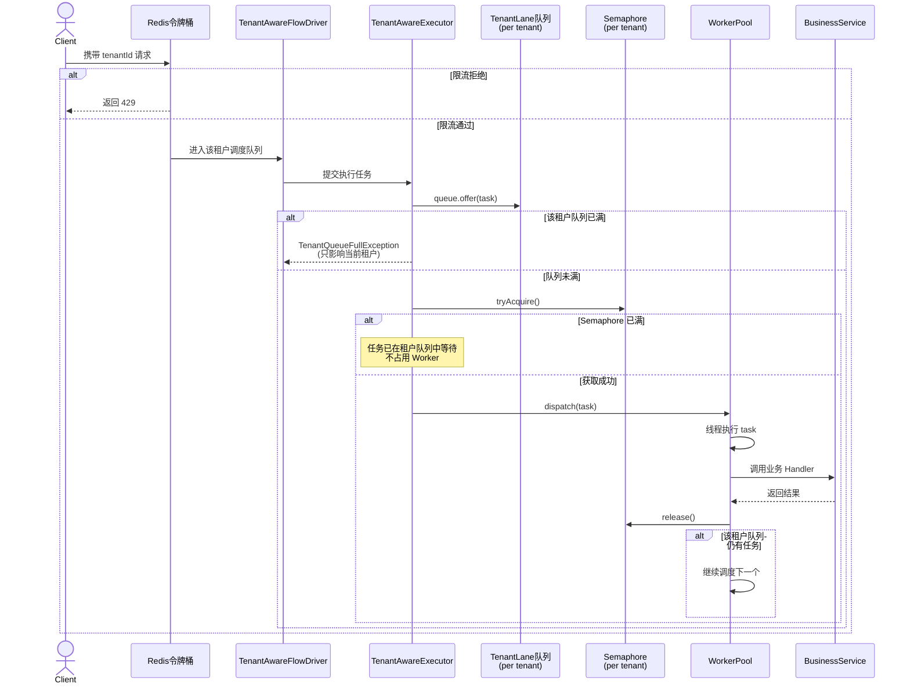

# 流程引擎资源隔离方案（重构版）

> 版本：v2.0
> 背景：流程引擎作为 SaaS 服务基座，面向多个业务方共享同一套引擎集群。本方案聚焦 ToB SaaS 场景（典型 TPS < 5000），解决"单租户异常扩散"问题，在不做独立部署的前提下实现租户级资源边界管控。
> 目标读者：技术评审、面试答辩、团队内部方案沉淀。

---

## 一、方案概述

### 1.1 核心问题

多个租户共用一套流程引擎集群，单个租户的异常行为（流量洪峰、Bug 死循环、下游故障）可能扩散为全服故障。

### 1.2 设计原则

| 原则 | 说明 |
|------|------|
| **共享服务、分层隔离** | 不独立部署，在共享服务内部划定租户边界 |
| **准入优先** | 超限流量在入口处直接拒绝 |
| **调度公平** | 单线程 EventLoop 不能被单租户垄断 |
| **执行隔离** | 租户独立队列 + Semaphore 并发上限，避免共享队列被集体打满 |
| **内存保护** | 单租户活跃实例数监控 + 软限制告警 + 硬限制兜底 |
| **熔断兜底** | 单租户异常时不影响其他租户 |

### 1.3 核心结论

> **多租户隔离的核心不是复制服务，而是在共享服务内部建立租户边界。**

---

## 二、整体架构

```
用户请求
   ↓
Nginx（按 instance_id 一致性哈希路由）
   ↓
┌─────────────────────────────────────────┐
│           流程引擎服务                    │
│  ┌─────────────────────────────────────┐│
│  │ ① 入口层：Redis 令牌桶限流           ││
│  │    · 租户级 QPS 限制                 ││
│  │    · 跨机器共享状态                  ││
│  └─────────────────────────────────────┘│
│  ┌─────────────────────────────────────┐│
│  │ ② 调度层：TenantAwareFlowDriver      ││
│  │    · 单线程 EventLoop                ││
│  │    · 租户独立队列 + 公平轮询          ││
│  └─────────────────────────────────────┘│
│  ┌─────────────────────────────────────┐│
│  │ ③ 执行层：TenantAwareExecutor        ││
│  │    · 租户独立队列（Tenant Lane）      ││
│  │    · 租户级 Semaphore 并发隔离       ││
│  │    · 状态变更批量合并                ││
│  │    · Resilience4j Behavior 熔断      ││
│  └─────────────────────────────────────┘│
│  ┌─────────────────────────────────────┐│
│  │ ④ 内存层：TenantMemoryQuota          ││
│  │    · 单租户活跃实例监控              ││
│  │    · 软限制告警 + 硬限制兜底         ││
│  │    · 过期实例自动归档                ││
│  └─────────────────────────────────────┘│
│  ┌─────────────────────────────────────┐│
│  │ ⑤ 熔断兜底：TenantCircuitBreaker     ││
│  │    · 自动熔断（错误率/创建速率）      ││
│  │    · 分级熔断（创建/推进/查询）       ││
│  │    · 半开自动恢复 + 人工一键重置        ││
│  └─────────────────────────────────────┘│
└─────────────────────────────────────────┘
   ↓
Dubbo 双向 RPC
   ↓
┌─────────────────────────────────────────┐
│           业务服务（执行器）              │
│  · SDK 自动暴露 FlowTaskExecutor        │
│  · SDK 自动引用 FlowEngineCallback      │
│  · 业务方只写 Handler，SDK 自动回调      │
└─────────────────────────────────────────┘
```

---

## 三、关键技术点澄清

### 3.1 单线程 EventLoop 不是空转

```java
private void eventLoop() {
    while (running) {
        try {
            // take() 阻塞等待，没事件时线程挂起，CPU 接近 0
            FlowEvent event = eventQueue.take();
            processEvent(event);  // 驱动状态机
        } catch (InterruptedException e) {
            Thread.currentThread().interrupt();
            break;
        }
    }
}
```

**关键点**：`while(true)` 不等于空转。`BlockingQueue.take()` 会阻塞线程，和 Netty EventLoop 模型一致。

### 3.2 回调引擎是 SDK 自动完成的

业务方只写 Handler，不需要写回调代码。

```java
// 业务方代码
@FlowHandler(nodeType = "smsNotify")
public class SmsNotifyHandler implements FlowHandler {
    @Override
    public Object execute(Map<String, Object> input) {
        smsService.send(input.get("phone"));
        return "success";  // 只返回结果
    }
}
```

SDK 内部自动完成：
1. 暴露 `FlowTaskExecutor` Dubbo 接口
2. 执行 Handler
3. 调用引擎的 `FlowEngineCallback`

### 3.3 租户队列深度 ≠ Semaphore 上限

| 概念 | 含义 |
|------|------|
| **Semaphore 上限** | 单个租户**同时执行**的最大任务数 |
| **租户队列深度** | 单个租户**排队等待**的最大任务数 |

每个租户有独立队列；Semaphore 是"同一时刻最多执行多少"，队列是"最多允许多少个在排队"。队列满只拒绝该租户，不会牵连其他租户。

### 3.4 为什么不用"全局线程池 + 租户 Semaphore"

```java
// 这种方案有隐患：任务拿到 Semaphore 后仍进入共享队列
ThreadPoolExecutor workerPool = new ThreadPoolExecutor(200, 200, ..., new LinkedBlockingQueue<>(1000));
Map<String, Semaphore> tenantSemaphores = new ConcurrentHashMap<>();

// A、B、C 同时提交任务，共享队列可能在某一刻被集体打满
// 正常租户 D 提交时也会 Rejected，且无法预判何时会爆
```

因此改用**租户独立队列（Tenant Lane）**：
- 每个租户有自己的队列，深度可控、可观测。
- 只有拿到 Semaphore 的任务才进入共享线程池。
- 拒绝行为发生在租户自身边界，不会影响其他租户。

### 3.5 失败后的策略

| 失败原因 | 处理策略 |
|---------|---------|
| 租户自身队列已满 | 快速失败（返回租户过载）/ 延迟重试（关键任务）+ 监控告警 |
| 租户自身 Semaphore 满 | 任务在租户队列中排队等待，不直接失败 |
| Behavior 下游故障 | 熔断 + 降级 |
| 租户级熔断触发 | 分级拒绝：CREATE 拒绝，TRANSITION/QUERY 放行 + 半开自动恢复 |
| Redis 限流失效 | 降级为本地限流 |
| 全局 Worker 池饱和 | 全局限流 + 告警 + 弹性扩容 |

> **流程引擎兜底原则**：流程引擎是状态机驱动的异步系统，单个状态变更请求允许短时失败，只要事件不丢失、可重试且状态机幂等，就能保证最终一致性。因此 Tenant Lane 队列满时的"快速失败 + 延迟重试"是合理策略，不需要像交易系统那样强制同步成功。

### 3.6 任务幂等由谁保证

流程引擎的故障恢复（重启对账、重试）会导致同一个任务被多次执行。推荐由**引擎记录任务执行结果**来实现业务无感知的幂等。

#### 推荐方案：引擎缓存执行结果

引擎为每次任务执行生成唯一 `taskExecutionId`，并将输入、输出、状态持久化到 `task_execution` 表。重试时先查表，已成功的直接返回缓存结果，不再调用业务 Handler。

```java
public class IdempotentTaskExecutor {
    
    public Object execute(String taskExecutionId, TaskInput input, Supplier<Object> handler) {
        TaskExecution execution = taskExecutionRepo.findById(taskExecutionId);
        
        if (execution != null && execution.getStatus() == SUCCESS) {
            return execution.getOutput(); // 已执行过，直接返回结果
        }
        
        taskExecutionRepo.save(TaskExecution.builder()
            .id(taskExecutionId)
            .status(RUNNING)
            .input(input)
            .build());
        
        Object output = handler.get(); // 业务 Handler 完全无感知
        
        taskExecutionRepo.save(TaskExecution.builder()
            .id(taskExecutionId)
            .status(SUCCESS)
            .output(output)
            .build());
        
        return output;
    }
}
```

#### 业务 Handler 代码示例

```java
@FlowHandler(nodeType = "smsNotify")
public class SmsNotifyHandler implements FlowHandler {
    @Override
    public Object execute(Map<String, Object> input) {
        smsService.send(input.get("phone"));  // 普通业务代码，无需幂等处理
        return "success";
    }
}
```

#### 关键前提

该方案在绝大多数场景下能做到"恰好一次"，但存在一个极小概率窗口：

> 引擎调用 Handler 成功后、写入 SUCCESS 之前，节点崩溃。恢复后引擎看到状态仍为 RUNNING，会再次调用 Handler。

因此该方案本质是**"至少一次"执行 + 引擎级去重**。如果业务副作用对重复执行零容忍（如支付扣款），必须选择其一：

- 接受极小概率的重复（绝大多数 ToB SaaS 场景可接受）；
- 要求业务系统提供一个"按 taskExecutionId 查询是否已执行"的接口，引擎重试前先查询；
- 采用两阶段提交 / Saga 模式（复杂度高，业务端仍需配合 prepare/commit/rollback 接口）。

---

## 四、分层隔离实现

### 4.1 入口层：Redis 集中式令牌桶

```java
@Component
public class RedisTenantRateLimiter {
    
    private static final String KEY_PREFIX = "flow:rate:bucket:";
    
    public boolean tryAcquire(String tenantId, int qps) {
        String lua = buildTokenBucketLua();
        Long result = redisTemplate.execute(
            new DefaultRedisScript<>(lua, Long.class),
            Collections.singletonList(KEY_PREFIX + tenantId),
            String.valueOf(qps),
            String.valueOf(qps * 2),
            String.valueOf(System.currentTimeMillis())
        );
        return result != null && result == 1L;
    }
}
```

### 4.2 调度层：租户独立队列 + 公平轮询

```java
public class TenantAwareFlowDriver {
    
    private final Map<String, LinkedBlockingQueue<FlowInstance>> tenantQueues = 
        new ConcurrentHashMap<>();
    
    private final Thread eventLoopThread;
    
    public TenantAwareFlowDriver() {
        this.eventLoopThread = new Thread(this::eventLoop, "flow-driver");
        this.eventLoopThread.setDaemon(true);
        this.eventLoopThread.start();
    }
    
    private void eventLoop() {
        while (!Thread.interrupted()) {
            FlowInstance instance = pollFair();
            if (instance != null) {
                processStateTransition(instance);
            }
        }
    }
    
    private FlowInstance pollFair() {
        // 轮询各租户队列，每人一次调度机会
        // 所有队列空时阻塞等待
    }
}
```

### 4.3 执行层：租户独立队列 + Semaphore + Behavior 熔断

传统"共享线程池 + 租户 Semaphore"的方案有一个隐患：任务即使拿到 Semaphore，也会先进入共享线程池队列。多个租户同时提交时，共享队列可能在某个时刻被集体打满，导致正常租户也被拒绝，且无法预判何时会爆。

因此采用**租户独立队列（Tenant Lane）**模型：

```java
public class TenantAwareExecutor {
    
    private final ThreadPoolExecutor workerPool;
    private final Map<String, TenantLane> tenantLanes = new ConcurrentHashMap<>();
    
    public boolean submit(String tenantId, Runnable task) {
        TenantLane lane = tenantLanes.computeIfAbsent(
            tenantId, k -> createLane(tenantId)
        );
        
        // 1. 先进入租户私有队列，队列满只影响当前租户
        if (!lane.queue.offer(task)) {
            throw new TenantQueueFullException(tenantId);
        }
        
        // 2. 尝试调度
        dispatch(lane);
        return true;
    }
    
    /**
     * 自定义拒绝策略回队时使用：将任务放回队首并触发重新调度
     */
    public boolean requeue(String tenantId, Runnable task) {
        TenantLane lane = tenantLanes.get(tenantId);
        if (lane == null) {
            return false;
        }
        
        if (!lane.queue.offerFirst(task)) {
            return false;
        }
        
        dispatch(lane);
        return true;
    }
    
    private void dispatch(TenantLane lane) {
        // 获取执行信号量，失败说明并发度已满
        if (!lane.semaphore.tryAcquire()) {
            return;
        }
        
        Runnable task = lane.queue.poll();
        if (task == null) {
            lane.semaphore.release();
            return;
        }
        
        // 提交给 Worker 池；若 Worker 池饱和，由自定义拒绝策略处理回队
        workerPool.execute(new TenantTaskWrapper(lane, task));
    }
    
    private TenantLane createLane(String tenantId) {
        int limit = tenantConfigService.getConcurrencyLimit(tenantId);
        int queueSize = tenantConfigService.getQueueSize(tenantId);
        return new TenantLane(
            tenantId,
            new LinkedBlockingDeque<>(queueSize),
            new Semaphore(limit)
        );
    }
    
    private static class TenantLane {
        final String tenantId;
        final LinkedBlockingDeque<Runnable> queue;
        final Semaphore semaphore;
        
        TenantLane(String tenantId, LinkedBlockingDeque<Runnable> queue, Semaphore semaphore) {
            this.tenantId = tenantId;
            this.queue = queue;
            this.semaphore = semaphore;
        }
    }
    
    // 包级可见，供自定义拒绝策略访问
    static class TenantTaskWrapper implements Runnable {
        final TenantLane lane;
        final Runnable firstTask;
        
        TenantTaskWrapper(TenantLane lane, Runnable firstTask) {
            this.lane = lane;
            this.firstTask = firstTask;
        }
        
        @Override
        public void run() {
            Runnable task = firstTask;
            
            // 循环消费同一租户队列，避免递归调用导致栈溢出
            while (task != null) {
                try {
                    task.run();
                } catch (Exception e) {
                    log.error("租户 {} 任务执行异常", lane.tenantId, e);
                } finally {
                    lane.semaphore.release();
                }
                
                // 尝试继续消费，拿不到信号量则退出，由其他 worker 接力
                if (!lane.semaphore.tryAcquire()) {
                    break;
                }
                
                task = lane.queue.poll();
                if (task == null) {
                    lane.semaphore.release();
                    break;
                }
            }
        }
    }
}
```

**关键点**：
- 每个租户有独立队列，深度可观测、可配置。
- 共享线程池只接收已拿到 Semaphore 的任务，不会因某个租户突发流量而集体爆队列。
- Worker 线程循环消费同一租户队列，避免递归调用导致栈溢出。
- 拒绝发生在租户自己的队列边界，故障范围可控。

#### 执行时序



#### Worker 池自定义拒绝策略

Tenant Lane 已大幅降低 Worker 池饱和概率，但仍建议配置自定义拒绝策略作为最后兜底。核心原则：**拒绝的任务不能丢，必须能重试**。

```java
public class TenantLaneRequeuePolicy implements RejectedExecutionHandler {
    
    private final TenantAwareExecutor tenantExecutor;
    private final RetryRepository retryRepository;
    private final AlarmService alarmService;
    
    TenantLaneRequeuePolicy(TenantAwareExecutor tenantExecutor,
                           RetryRepository retryRepository,
                           AlarmService alarmService) {
        this.tenantExecutor = tenantExecutor;
        this.retryRepository = retryRepository;
        this.alarmService = alarmService;
    }
    
    @Override
    public void rejectedExecution(Runnable r, ThreadPoolExecutor executor) {
        if (r instanceof TenantAwareExecutor.TenantTaskWrapper wrapper) {
            String tenantId = wrapper.lane.tenantId;
            
            // 任务已从队列取出但未能进入 Worker 池，释放信号量并回队
            wrapper.lane.semaphore.release();
            boolean requeued = tenantExecutor.requeue(tenantId, wrapper.firstTask);
            
            if (!requeued) {
                // 极端情况：租户队列也满，持久化到重试表
                retryRepository.save(tenantId, wrapper.firstTask);
                alarmService.sendCritical(
                    "Worker 池 + 租户队列双满，任务已持久化到重试表: " + tenantId
                );
            } else {
                alarmService.warn("Worker 池临时饱和，任务已回队: " + tenantId);
            }
        } else {
            alarmService.sendCritical("未知任务被 Worker 池拒绝");
            throw new RejectedExecutionException("Unknown task rejected");
        }
    }
}
```

使用：

```java
ThreadPoolExecutor workerPool = new ThreadPoolExecutor(
    200, 200, 0L, TimeUnit.MILLISECONDS,
    new LinkedBlockingQueue<>(1000),
    new TenantLaneRequeuePolicy(tenantExecutor, retryRepository, alarmService)
);
```

**关键点**：
- 拒绝 ≠ 不执行，只是延迟执行。
- 回队优先，落库兜底。
- 任何拒绝都必须告警，说明容量规划或套餐配置需要调整。

### 4.4 内存层：活跃实例监控与保护

静态实例数配额很难一次性设定准确，建议采用**监控 + 软限制 + 硬限制**的分层策略：

```java
@Component
public class TenantMemoryQuota {
    
    private final Map<String, AtomicInteger> activeInstances = new ConcurrentHashMap<>();
    
    public boolean tryRegister(String tenantId) {
        int softLimit = tenantConfigService.getSoftLimit(tenantId);
        int hardLimit = tenantConfigService.getHardLimit(tenantId);
        
        AtomicInteger counter = activeInstances.computeIfAbsent(
            tenantId, k -> new AtomicInteger(0)
        );
        int current = counter.incrementAndGet();
        
        // 软限制：告警，但不拒绝
        if (current > softLimit && current <= hardLimit) {
            alarmService.warn("租户 " + tenantId + " 活跃实例数超过软限制：" + current);
        }
        
        // 硬限制：最后一道防线，防止 OOM
        if (current > hardLimit) {
            counter.decrementAndGet();
            throw new TenantQuotaException("活跃实例超过硬限制");
        }
        
        return true;
    }
}
```

**配额估算参考**：

```
单租户硬限制 ≈ (JVM 堆大小 - 引擎自身开销 - 其他缓存) 
              ÷ 单实例平均内存占用 
              ÷ 租户数量 
              ÷ 安全系数(建议 2~3)
```

例如：4GB 堆，引擎和缓存占 1GB，单实例平均 100KB，50 个租户，安全系数 2：
- 可用内存：3GB ≈ 3,000,000 KB
- 单租户硬限制 ≈ 3,000,000 / 100 / 50 / 2 = **3000 实例**
- 软限制可设为硬限制的 70%，即 **2100 实例**

**关键原则**：
- 先通过入口限流和生命周期管理控制实例数量。
- 内存保护是最后防线，不是日常依赖手段。
- 软限制用于运营预警，硬限制用于防止 OOM。

### 4.5 熔断兜底

流程引擎的熔断不能"一开全拒"，必须区分操作类型：

- **CREATE**：新流程实例创建，是流量入口，可以拒绝。
- **TRANSITION**：已有实例状态推进，拒绝会导致流程卡死，应尽可能放行。
- **QUERY**：只读查询，通常不消耗核心资源，应放行。

```java
@Component
public class TenantCircuitBreaker {
    
    enum State { CLOSED, OPEN, HALF_OPEN }
    enum OpType { CREATE, TRANSITION, QUERY }
    
    private final Map<String, State> tenantStates = new ConcurrentHashMap<>();
    private final Map<String, Long> openTimes = new ConcurrentHashMap<>();
    private final long halfOpenTimeoutMs = 30_000; // 30s 后尝试恢复
    
    public void autoTrip(String tenantId, MetricSnapshot snapshot) {
        if (snapshot.errorRate() > 0.9 || snapshot.createRate() > baseline * 10) {
            tenantStates.put(tenantId, State.OPEN);
            openTimes.put(tenantId, System.currentTimeMillis());
            alarmService.sendCritical("租户 " + tenantId + " 已被自动熔断");
        }
    }
    
    public boolean allow(String tenantId, OpType opType) {
        State state = tenantStates.getOrDefault(tenantId, State.CLOSED);
        
        if (state == State.CLOSED) {
            return true;
        }
        
        if (state == State.OPEN) {
            Long openTime = openTimes.get(tenantId);
            if (openTime != null 
                && System.currentTimeMillis() - openTime > halfOpenTimeoutMs) {
                // 冷却结束，进入半开状态自动试探
                tenantStates.put(tenantId, State.HALF_OPEN);
                return allow(tenantId, opType);
            }
            // 分级：只拒绝 CREATE，TRANSITION 和 QUERY 放行
            return opType != OpType.CREATE;
        }
        
        // HALF_OPEN：允许流量通过，由调用方上报 success/failure 决定后续状态
        return true;
    }
    
    public void recordSuccess(String tenantId) {
        if (tenantStates.get(tenantId) == State.HALF_OPEN) {
            tenantStates.put(tenantId, State.CLOSED);
            openTimes.remove(tenantId);
            alarmService.info("租户 " + tenantId + " 熔断自动恢复");
        }
    }
    
    public void recordFailure(String tenantId) {
        if (tenantStates.get(tenantId) == State.HALF_OPEN) {
            tenantStates.put(tenantId, State.OPEN);
            openTimes.put(tenantId, System.currentTimeMillis());
            alarmService.sendCritical("租户 " + tenantId + " 半开恢复失败，重新熔断");
        }
    }
    
    public void manualReset(String tenantId) {
        tenantStates.put(tenantId, State.CLOSED);
        openTimes.remove(tenantId);
        alarmService.info("租户 " + tenantId + " 已人工重置熔断");
    }
}
```

**关键点**：
- 熔断是**最后兜底**，不是常态。
- 已有流程实例的状态推进应优先保障，避免业务卡死。
- 自动半开恢复减少人工介入，但人工重置仍需保留。

---

## 五、技术选型说明

| 能力 | 选型 | 原因 |
|------|------|------|
| Behavior 级熔断 | Resilience4j / Sentinel | 成熟框架，直接复用 |
| 租户级 Semaphore 并发隔离 | 自研 | 动态租户、分级配额、租户独立队列（Tenant Lane） |
| 入口限流 | Redis + Lua 自研 | 跨机器共享状态，依赖现有基础设施 |
| 调度层租户队列 | 自研 | 流程引擎 EventLoop 特有模型 |
| 内存保护 | 自研 | 流程实例长生命周期管理 |

**为什么不用 Resilience4j Bulkhead / Sentinel 做租户隔离？**

它们都是按"资源/方法"维度做信号量隔离：
- Resilience4j：`@Bulkhead(name = "paymentService")`
- Sentinel：`rule.setResource("sayHello")`

但我们要的是按"动态租户 ID"维度隔离。租户数量不固定、配额分级、共享全局线程池，这些都需要自研。

---

## 六、性能与瓶颈

### 6.1 关键指标

| 指标 | 健康范围 | 告警阈值 |
|------|---------|---------|
| 线程池活跃线程数 | < 80% 上限 | 80% |
| 租户队列深度 | < 80% 长度 | 80% |
| 租户 Semaphore 占用 | < 80% 上限 | 80% |
| Redis 限流 RTT | < 2ms | 5ms |
| DB 写入延迟 | < 20ms | 50ms |
| 租户错误率 | < 5% | 50% |

### 6.2 主要瓶颈

1. **Redis 限流 RTT**：每次请求都需一次 Redis 往返（Lua 令牌桶）。当引擎集群总 TPS 达到几万、或 Redis 为共享集群/存在单租户热 key 时，RTT 与 Redis CPU 会成为延迟放大点；常规 TPS（几千以下）通常不构成瓶颈。可优化为本地令牌桶 + Redis 异步同步。
2. **状态机同步写入**：状态变更采用同步写 + 乐观锁，高并发时版本冲突会导致重试放大；可通过批量合并 + 合理索引缓解。MySQL 本身在合理设计下并非瓶颈（如 XXL-JOB 的调度表同样基于 MySQL 且不构成 QPS 瓶颈），瓶颈在于同步写带来的锁竞争与放大。
3. **租户队列容量配置**：队列过小导致突发任务被拒绝，队列过大则积压失去时效性，需按租户等级设定并配合监控告警。
4. **单线程 EventLoop**：ToB SaaS 常规 TPS 下足够；若未来规模持续增长，可按租户或分片扩展为多个 EventLoop。
5. **活跃实例配额调优**：实例内存占用差异大、租户行为不可预测，静态配额容易误杀或失效。建议采用软限制告警 + 硬限制兜底，并根据实际监控持续调整。

---

## 七、生产验证与监控

### 7.1 必做验证

1. **基线压测**：单机 TPS 拐点、线程池饱和点、DB 性能拐点
2. **单租户异常扩散演练**：单租户流量洪峰，验证其他租户不受影响
3. **故障注入**：Redis 抖动、MySQL 慢查询、下游服务超时
4. **缩容验证**：有状态服务缩容需等待存量实例完成

### 7.2 监控看板

```promql
# 租户 A 调度队列深度
flow_driver_queue_depth{tenant_id="tenant_a"}

# 各租户 Semaphore 占用排行
topk(5, sum(flow_tenant_concurrency_used) by (tenant_id))

# 各租户错误率排行
topk(5, sum(rate(flow_callback_errors_total[5m])) by (tenant_id))
```

---

## 八、架构师评估

### 8.1 优点

- 成本远低于独立部署
- 运维简单，一套代码一套镜像
- 四层防护 + 熔断兜底，隔离效果完整
- 可渐进落地，风险可控
- 与现有 Dubbo/Redis/MySQL 技术栈契合

### 8.2 缺点

- 非绝对隔离，全局 Worker 池饱和或共享 DB 慢查询仍可能互相影响
- 配置复杂度高，需要按租户等级抽象为套餐并持续调优
- 依赖 Redis 可用性
- 动态租户多时内存 Map 需要清理
- 有状态服务缩容不灵活

### 8.3 适用边界

| 场景 | 是否适合 |
|------|---------|
| 租户数量 < 50 | ✅ 适合 |
| 租户数量 > 200 | ⚠️ 需简化方案 |
| 强合规隔离要求 | ❌ 需独立部署 |
| 大客户流量百倍差异 | ⚠️ 大客户独立资源 |

### 8.4 剩余风险与建议

| 风险 | 等级 | 建议 |
|------|------|------|
| 单 EventLoop 线程故障 | 中 | 加守护线程/健康检查，异常退出后自动重建或告警 |
| 节点崩溃丢内存状态 | 中 | 关键状态定期对账或持久化，节点重启后从 DB 恢复 |
| 动态 Map 内存泄漏 | 中 | 对 `tenantLanes`、`tenantSemaphores` 等加 TTL 或下线租户清理 |
| 配置调优复杂 | 中 | 将租户配置抽象为 S/M/L 套餐，不要每个租户单独配所有参数 |
| Worker 池 RejectedExecution | 低 | Tenant Lane 已缓解，但仍需配 `CallerRunsPolicy` 或自定义拒绝策略 |
| 共享 DB 慢查询/热 key | 低 | 加强 SQL 慢查询监控和 TopN 租户告警 |

### 8.5 节点故障恢复优化方向

节点故障恢复的投入应分阶段，从易到难：

#### Level 1：EventLoop 守护（必做，低成本）

- **看门狗线程**：独立线程每秒检查 EventLoop 是否存活，死亡则重建并告警。
- **健康检查端点**：`/health` 返回 EventLoop 心跳，供 LB/K8s 探针使用。
- **异常捕获**：EventLoop 循环体用 try-catch 包裹，不因单条事件异常而退出。

```java
public class GuardedEventLoop {
    private final AtomicLong processed = new AtomicLong(0);
    private volatile Thread eventLoopThread;
    
    public void start() {
        eventLoopThread = new Thread(this::loop, "flow-driver");
        eventLoopThread.setUncaughtExceptionHandler((t, e) -> {
            alarmService.sendCritical("EventLoop 异常退出", e);
            start(); // 重建
        });
        eventLoopThread.start();
        
        // 看门狗：检测卡死
        Executors.newSingleThreadScheduledExecutor()
            .scheduleAtFixedRate(() -> {
                long before = processed.get();
                LockSupport.parkNanos(1_000_000_000L);
                if (processed.get() == before && eventLoopThread.isAlive()) {
                    alarmService.warn("EventLoop 可能卡死");
                }
            }, 10, 10, TimeUnit.SECONDS);
    }
}
```

#### Level 2：优雅关闭 + 启动对账（推荐，中成本）

- **SIGTERM 钩子**：收到下线信号后，停止接收新事件，等待 Tenant Lane 队列排空（timeout 60s）。
- **启动对账**：节点启动时扫描 DB，重建处于"运行中 / 待处理"状态的实例到内存队列和计数器。
- **任务执行状态持久化**：引擎为每个任务生成 `taskExecutionId`，记录 RUNNING/SUCCESS/FAILURE 状态，并缓存执行结果。恢复时根据状态判断是否需要重试；已成功的直接返回缓存结果，不再调用业务 Handler。
- **业务 Handler 无感知幂等**：业务 Handler 不需要处理幂等，由引擎通过 `task_execution` 表去重。详见 3.6 节。

```java
@Component
public class InstanceReconciler {
    
    public void reconcileOnStartup() {
        List<FlowInstance> activeInstances = flowInstanceRepo.findByStatusIn(
            Arrays.asList(RUNNING, PENDING)
        );
        
        for (FlowInstance instance : activeInstances) {
            if (belongsToCurrentNode(instance.getId())) {
                flowDriver.enqueue(instance);
                memoryQuota.tryRegister(instance.getTenantId());
            }
        }
    }
}
```

#### Level 3：事件 WAL + 实例租约（高可用，高成本）

- **事件预写日志（WAL）**：关键事件先写 WAL（本地文件 / Kafka / RocketMQ），再进入内存队列；重启后重放 WAL。
- **实例租约**：每个节点为负责的实例维持心跳租约；节点故障后，租约过期，其他节点接管。
- **事件去重**：WAL 重放或租约接管时，根据事件 ID 幂等去重。

**落地建议**：MVP 阶段做 Level 1；第二阶段做 Level 2；Level 3 视业务对可用性的要求后续演进。

### 8.6 租户配置套餐化

为降低配置调优复杂度，将租户配置抽象为三级内置套餐，避免为每个租户单独配置所有参数。

| 配置项 | S 套餐（基础版） | M 套餐（标准版） | L 套餐（企业版） |
|--------|----------------|----------------|----------------|
| 适用对象 | 小客户 / 试用租户 | 中型客户 | 大客户 / 核心客户 |
| QPS 限制 | 50/s | 200/s | 1000/s |
| 租户队列深度 | 100 | 500 | 2000 |
| Semaphore 并发上限 | 5 | 20 | 50 |
| 活跃实例软限制 | 500 | 2000 | 8000 |
| 活跃实例硬限制 | 1000 | 4000 | 15000 |

**使用规则**：
- 新租户默认接入 S 套餐。
- 根据业务体量、合同 SLA 升级到 M 或 L。
- 超大规模客户可单独定制，但运营侧尽量不开放逐参数配置，减少配置漂移和运维负担。

---

## 九、下一步计划

### 第一阶段：MVP（2 周）

- 入口 Redis 限流
- 租户独立队列（Tenant Lane）+ 租户 Semaphore
- 基础监控告警
- 基线压测

### 第二阶段：完整隔离（2 周）

- 调度层租户队列
- 状态变更批量合并 + DB 熔断保护
- 内存保护（软限制告警 + 硬限制兜底）+ 过期归档
- Resilience4j Behavior 熔断

### 第三阶段：生产打磨（1 个月）

- 配置中心热更新
- 租户分级模型
- 混沌工程演练
- 运维调优手册

### 第四阶段：架构演进（2-3 个月）

- 执行层独立化
- Serverless 化重 IO Behavior
- 动态配额调整
- 多地域部署

---

## 十、面试应答要点

### Q1：为什么不做独立部署？

> 独立部署隔离性最强，但版本碎片化、运维成本线性增长、资源利用率低。AWS Lambda 官方也明确说单租户部署有 significant operational overhead。我们用共享服务 + 分层隔离解决 90% 的问题，只有合规强制或流量百倍差异时才独立部署。

### Q2：单线程 EventLoop 会不会空转 CPU？

> 不会。EventLoop 用 `BlockingQueue.take()` 阻塞等待事件，没事件时线程挂起，CPU 接近 0。这个模型和 Netty EventLoop 一致。

### Q3：业务方需要写回调代码吗？

> 不需要。业务方只写 Handler 并返回结果，SDK 自动暴露 Dubbo 接口、执行 Handler、回调引擎。

### Q4：为什么不用 Resilience4j / Sentinel 做租户隔离？

> 它们都是按"资源/方法"维度做隔离，我们要的是按"动态租户 ID"维度隔离。租户动态增长、配额分级、共享全局线程池，这些需要自研。但 Behavior 熔断可以直接复用它们。

### Q5：Semaphore 上限怎么定？

> 经验公式：租户并发上限 = 该租户业务峰值并发 × 安全系数（1.5~2）；队列深度 = 并发上限 × 平均任务耗时 × 容忍倍数。上线后根据监控调整。

---

## 十一、参考资料

| 我们的设计 | 业界对应实践 | 链接 |
|-----------|------------|------|
| 共享服务 + 分层隔离 | AWS Lambda Tenant Isolation | https://aws.amazon.com/blogs/aws/streamlined-multi-tenant-application-development-with-tenant-isolation-mode-in-aws-lambda |
| Semaphore 并发隔离 | Resilience4j Bulkhead | https://resilience4j.readme.io/docs/bulkhead |
| 并发线程数限流 | Sentinel Flow Control | https://github.com/alibaba/Sentinel/wiki/Flow-Control |
| 资源配额 | Kubernetes ResourceQuota | https://kubernetes.io/docs/tasks/administer-cluster/manage-resources/quota-memory-cpu-namespace/ |
| Serverless 并发限制 | 阿里云 FC 并发实例上限 | https://help.aliyun.com/zh/functioncompute/fc/user-guide/overview-of-configuring-the-maximum-number-of-on-demand-instances |
| EventLoop 模型 | Reactor Netty | https://projectreactor.io/docs/netty/1.1.17/reference |
